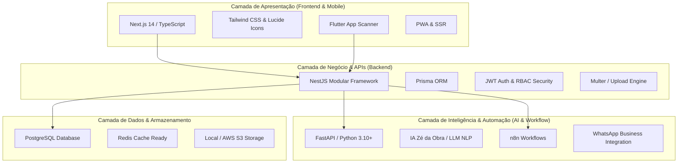

# 🏗️ HubObra / Loja Moderna - Documentação do Ecossistema Completo
> **Relatório Oficial de Tecnologias Embarcadas, Arquitetura e Funcionalidades Operacionais**  
> *Versão:* 2.0 (Produção / 98%+ Implementado)  
> *Data de Atualização:* Setembro de 2026

---

## 📌 1. Visão Geral do Projeto
O **HubObra (Loja Moderna)** é uma plataforma completa de **E-commerce Omnichannel, Inteligente e Headless**, desenvolvida especificamente para o segmento de **Depósitos e Lojas de Materiais de Construção**. 

O ecossistema integra em uma única solução:
- **Loja Virtual de Alta Performance** (Mobile-First, PWA e SSR)
- **Painel Administrativo Completo** (Backoffice para controle total do lojista)
- **Assistente Virtual com IA** (*Zé da Obra* & *Lia Multimodal* para cálculo de materiais e orçamentos)
- **Integração com WhatsApp & Recibos em PDF** (Envio instantâneo e automações via n8n)
- **Aplicativo Mobile de Depósito** (Leitor de código de barras / EAN em Flutter)
- **Arquitetura Multi-Tenant / SaaS-Ready** (Suporte a múltiplas lojas no mesmo banco)

---

## 🛠️ 2. Stack Tecnológica Embarcada



### 💻 Frontend (Web Storefront & Admin)
* **Framework:** Next.js 14 (com App Router)
* **Linguagem:** TypeScript 5+
* **Estilização & UI:** Tailwind CSS + Radix UI Primitives + Lucide React Icons
* **Gerenciamento de Estado:** React Context API (Auth, Cart, Favorites, ComponentsConfig)
* **Validação de Formulários:** Zod + React Hook Form
* **Comunicação:** Axios & Fetch API nativo com interceptors de autenticação
* **Recibos & Impressão:** Sistema personalizado de renderização A4 e exportação para PDF/WhatsApp

### ⚙️ Backend (API de Microsserviços)
* **Framework:** NestJS (Node.js com arquitetura modular limpa)
* **Linguagem:** TypeScript
* **ORM & Banco de Dados:** Prisma ORM com PostgreSQL (e compatibilidade de transição para SQLite)
* **Segurança & Autenticação:** JWT (JSON Web Tokens), Passport.js, Bcrypt, RBAC (Role-Based Access Control)
* **Validação de Entrada:** `class-validator` + `class-transformer` com DTOs tipados
* **Upload de Mídias:** Engine com `multer`, validação de MIME types, limites de tamanho e redimensionamento
* **Documentação de API:** Swagger / OpenAPI

### 🤖 Inteligência Artificial & Automações
* **Serviço de IA:** Python 3.10+ com **FastAPI**
* **Módulos de IA:** 
  * **Zé da Obra:** Assistente de cálculo de obras (cimento, alvenaria, pisos, tintas, argamassa)
  * **Lia Multimodal:** Agente de triagem e conversação inteligente
* **Automação de Mensageria:** **n8n** (workflows para disparos automáticos de pedidos, orçamentos e recibos no WhatsApp)

### 📱 Mobile & Depósito
* **Aplicativo:** Flutter / Dart (`app_flutter_scanner`)
* **Funcionalidade:** Leitor de código de barras e EAN via câmera para conferência de estoque, preços e separação de pedidos

### 🚀 Infraestrutura & DevOps
* **Containers:** Docker e Docker Compose
* **Hospedagem & Deploy:** AWS (EC2/S3) e compatibilidade com cPanel / PlusHost (Node.js Selector)
* **Controle de Versão:** Git + GitHub Actions (CI/CD)

---

## 📦 3. Módulos e Funcionalidades 100% Operacionais

### 🛒 3.1. Loja Virtual (Storefront)
- [x] **Vitrine Dinâmica:** Carrossel Hero rotativo com transições suaves, banners promocionais e atalhos rápidos de departamentos.
- [x] **Busca Inteligente (`/busca`):** Filtro multi-critério por nome, categoria, faixa de preço, marcas e ordenação (relevância, maior/menor preço, novidades).
- [x] **Páginas de Categoria (`/categoria/[slug]`):** Listagem segmentada, breadcrumbs navegáveis e contagem de itens.
- [x] **Detalhes do Produto (`/produtos/[id]`):** Galeria de fotos, cálculo por unidades especiais da construção civil (**UN, M², KG, Saco, Barra, Caixa, Milheiro, Litro**), especificações técnicas e produtos relacionados.
- [x] **Carrinho Inteligente (`/carrinho`):** Persistência no navegador, atualização dinâmica de quantidades, cálculo de subtotal e validação de estoque em tempo real.
- [x] **Sistema de Favoritos (`/favoritos`):** Painel do cliente para salvar produtos, estatísticas do valor total salvo, filtros rápidos e botão de exportação para CSV ou envio direto para o carrinho.
- [x] **Checkout Moderno (`/checkout`):** 
  - Cálculo de frete inteligente com suporte específico para **CEPs do Ceará e Nacional**.
  - Pagamento instantâneo via **PIX (Chave, QR Code e Copia e Cola)**.
  - Opção de pagamento na entrega (Dinheiro, Cartão, PIX no ato).
- [x] **Sistema de Recibo A4 / WhatsApp (`/pedidos`):**
  - Geração de recibo formal diagramado em padrão folha A4.
  - Botão de envio rápido do pedido detalhado diretamente para o WhatsApp da loja ou do cliente.

---

### 🎛️ 3.2. Painel Administrativo (Backoffice Lojista)
- [x] **Dashboard de Vendas (`/admin`):** Métricas de faturamento, novos pedidos, produtos mais vendidos e alertas de estoque baixo.
- [x] **Gestão de Produtos (`/admin/produtos`):**
  - CRUD completo de itens com precificação (preço de venda, custo, preço comparativo).
  - Upload de múltiplas imagens com preview instantâneo.
  - Busca automática de fotos e dados via código EAN no Google.
  - Gestão de estoque mínimo e alertas de reposição.
- [x] **Gestão de Categorias (`/admin/categorias`):** Organização em árvore hierárquica (Categorias e Subcategorias com ícones e fotos).
- [x] **Gerenciador de Banners (`/admin/banners`):** Criação e ativação de banners para Hero, Promocionais e Departamentos com controle de links e datas.
- [x] **Gestão de Pedidos (`/admin/pedidos`):** Acompanhamento do ciclo de vida do pedido (*Pendente ➔ Em Separação ➔ Enviado ➔ Entregue ➔ Cancelado*), com impressão de recibo interno.
- [x] **Gestão de Preços em Massa (`/admin/precos`):** Reajuste percentual ou por valor de grupos inteiros de produtos com histórico de alterações.
- [x] **Importação em Massa (`/admin/importacao`):** Carga rápida de catálogo via planilhas e arquivos estruturados.
- [x] **Gestão de Usuários & Acessos (`/admin/usuarios`):** Controle de papéis administrativos (`ADMIN`, `STORE_ADMIN`, `USER`).
- [x] **Monitoramento & Diagnóstico (`/admin/monitoramento`):** Logs do sistema, integridade do banco de dados e status dos serviços.

---

### 🤖 3.3. IA Especializada & Calculadora de Obras
- [x] **Zé da Obra (Chatbot Especialista):** Tira dúvidas sobre materiais, indica marcas adequadas para cada fase da obra (fundação, alvenaria, hidráulica, elétrica, acabamento).
- [x] **Calculadora de Materiais Integrada:**
  - Cálculo de cimento, areia e brita para concreto por m³.
  - Cálculo de tijolos/blocos e argamassa por m² de parede.
  - Cálculo de pisos, porcelanatos e argamassa colante com margem de quebra/recorte.
  - Cálculo de tintas (litros e demãos) por metragem de parede.
- [x] **Workflow n8n Multimodal:** Automação de atendimento que recebe a solicitação do cliente no WhatsApp, consulta os produtos no banco e monta o orçamento em PDF.

---

### 📱 3.4. App Flutter - Scanner de Estoque (HubScanner)
- [x] **Leitor de Código de Barras (Câmera do Celular):** Leitura instantânea de padrões EAN-13, CODE-128 e QR Codes.
- [x] **Digitação Manual de Código:** Entrada de números de código de barras ou SKU via teclado.
- [x] **Busca por Nome & Descrição do Produto:** Modal inteligente de busca textual (nome, marca, SKU) para itens com código danificado ou ausente.
- [x] **Consulta Instantânea & Ajuste Rápido:** Visualização de preço, estoque com alerta de reposição e ajuste direto no Supabase/PostgreSQL.
- [x] **Conferência de Pedidos:** Validação de itens durante a separação para evitar erros de despacho.

---

## 🗄️ 4. Modelagem de Dados (Entidades do Prisma)

O banco de dados PostgreSQL foi desenhado para escalabilidade e arquitetura multi-loja:

| Entidade | Descrição |
| :--- | :--- |
| `Store` | Estrutura central multi-tenant (suporta lojas filiais, subdomínios, CNPJ, cores e temas). |
| `User` | Clientes e operadores com controle de papéis (`USER`, `ADMIN`, `STORE_ADMIN`). |
| `Product` | Catálogo detalhado com SKU, EAN/Barcode, Unidade de Medida, Estoque Mínimo, Custo e Margem. |
| `ProductImage` | Múltiplas imagens por produto com flags de imagem principal. |
| `Category` | Categorias e subcategorias com suporte a auto-relacionamento hierárquico. |
| `Order` / `OrderItem` | Pedidos, itens comprados, status de entrega, dados do cliente e método de pagamento. |
| `Banner` | Banners responsivos com tipos (Hero, Promo, Dept), links de destino e ordem de exibição. |
| `PriceHistory` | Rastreabilidade de alterações de preço para auditoria e relatórios. |
| `ProductReview` | Avaliações e notas dos clientes para os materiais. |
| `Setting` | Configurações dinâmicas da loja (visibilidade de componentes, taxas, contatos). |

---

## ⚡ 5. Otimizações de Engenharia e Estabilidade Realizadas

1. **Sincronização de Autenticação & Token:** Correção de discrepâncias de token entre o `localStorage` do navegador e os headers de requisição do NestJS, garantindo sessões estáveis e seguras.
2. **Correção de Hidratação no Next.js:** Implementação de `HydrationHandler` e carregamento seguro de componentes no client-side para eliminar warnings do React.
3. **Pipeline de Upload Resiliente:** Validação rigorosa no `UploadService` para aceitar imagens de produtos e banners até 10MB, tratando nomes de arquivos com caracteres especiais e gerando URLs absolutas.
4. **Checkout e DTOs Blindados:** Validação rigorosa dos dados de pagamento e entrega, tratando casos de campos opcionais/nulos sem quebrar o fluxo de fechamento do pedido.
5. **Recibos Sem Erros de Menu/Interface:** Otimização da folha de recibo para exibição limpa e focada em impressão ou print para envio via WhatsApp.

---

## 📁 6. Estrutura de Diretórios do Repositório

```text
Projeto Loja Moderna/
├── frontend/                   # Aplicação Next.js 14 (Storefront + Admin)
│   ├── src/
│   │   ├── app/                # App Router (Rotas da loja, busca, checkout, admin)
│   │   ├── components/         # Componentes reutilizáveis (Banners, Cards, UI)
│   │   ├── contexts/           # Provedores de estado (Auth, Cart, Favorites)
│   │   └── hooks/              # Hooks customizados (useProducts, useBanners, etc.)
│   └── package.json
│
├── backend-nestjs/             # API Rest em NestJS
│   ├── src/
│   │   ├── auth/               # Autenticação JWT e Guards
│   │   ├── products/           # Módulo de produtos e catálogo
│   │   ├── categories/         # Módulo de categorias
│   │   ├── orders/             # Módulo de checkout e pedidos
│   │   ├── banners/            # Módulo de marketing e banners
│   │   ├── upload/             # Módulo de upload de arquivos
│   │   ├── price-management/   # Reajuste de preços em lote
│   │   └── prisma/             # Schema e conexão com banco
│   └── package.json
│
├── ia/                         # Microsserviço de IA (Python/FastAPI)
│   ├── main.py                 # Endpoints do Zé da Obra e calculadora
│   └── requirements.txt
│
├── app_flutter_scanner/        # Aplicativo Mobile em Flutter
│   └── lib/                    # Telas de scanner de código de barras
│
├── infra/                      # Configurações Docker e Deploy
├── docs/                       # Documentações técnicas específicas
└── ECOSSISTEMA_COMPLETO_DO_PROJETO.md # Este documento
```

---

## 🏆 7. Conclusão & Status Operacional
O projeto encontra-se em estágio **avançado de prontidão (98%+)**, com todos os fluxos críticos de compra, gestão comercial, cálculo de obra com IA e logística de separação por leitor de código de barras plenamente integrados e funcionais.
