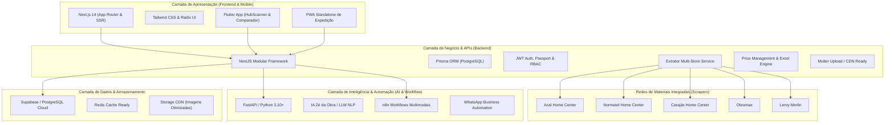

# 🏗️ HubObra / Loja Moderna - Documentação do Ecossistema Completo
> **Relatório Oficial de Tecnologias Embarcadas, Arquitetura, Módulos e Funcionalidades Operacionais**  
> *Versão:* 2.5 (Produção / 99%+ Implementado)  
> *Data de Atualização:* Setembro de 2026

---

## 📌 1. Visão Geral do Projeto
O **HubObra (Loja Moderna)** é uma plataforma completa de **E-commerce Omnichannel, Inteligente e Headless**, projetada e construída especificamente para o segmento de **Depósitos e Lojas de Materiais de Construção**. 

O ecossistema integra em uma única solução sincronizada:
- **Loja Virtual de Alta Performance** (Mobile-First, PWA, SSR, Checkout PIX & Recibos A4/WhatsApp)
- **Painel Administrativo Completo** (Backoffice com gestão de estoque, pedidos, banners e usuários)
- **Robô Extrator de Concorrentes & Inteligência de Preços** (Web scraper em tempo real de grandes redes do setor: Acal, Normatel, Carajás, Obramax e Leroy Merlin com importação em 1 clique)
- **Módulo Avançado de Gestão de Preços** (Edição ágil, filtros por categoria com contadores dinâmicos, reajustes em lote e exportação segmentada em Excel `.xlsx`)
- **Assistentes Virtuais com IA** (*Zé da Obra* & *Lia Multimodal* para cálculo de materiais e orçamentos)
- **Aplicativo Mobile Flutter de Depósito & Comparador** (Scanner EAN via câmera + busca rápida e comparativo com redes de materiais de construção)
- **PWA Dedicado de Expedição & Logística** (`/expedicao` para conferência tátil e despacho de pedidos)
- **Arquitetura Multi-Tenant / SaaS-Ready** (Pronto para múltiplas filiais e lojas com isolamento seguro)

---

## 🛠️ 2. Stack Tecnológica Embarcada


```mermaid
graph TD
    subgraph "Camada de Apresentação (Frontend & Mobile)"
        A1["Next.js 14 (App Router & SSR)"]
        A2["Tailwind CSS & Radix UI"]
        A3["Flutter App (HubScanner & Comparador)"]
        A4["PWA Standalone de Expedição"]
    end

    subgraph "Camada de Negócio & APIs (Backend)"
        B1["NestJS Modular Framework"]
        B2["Prisma ORM (PostgreSQL)"]
        B3["JWT Auth, Passport & RBAC"]
        B4["Extrator Multi-Store Service"]
        B5["Price Management & Excel Engine"]
        B6["Multer Upload / CDN Ready"]
    end

    subgraph "Camada de Inteligência & Automação (AI & Workflow)"
        C1["FastAPI / Python 3.10+"]
        C2["IA Zé da Obra / LLM NLP"]
        C3["n8n Workflows Multimodais"]
        C4["WhatsApp Business Automation"]
    end

    subgraph "Redes de Materiais Integradas (Scrapers)"
        E1["Acal Home Center"]
        E2["Normatel Home Center"]
        E3["Carajás Home Center"]
        E4["Obramax"]
        E5["Leroy Merlin"]
    end

    subgraph "Camada de Dados & Armazenamento"
        D1["Supabase / PostgreSQL Cloud"]
        D2["Redis Cache Ready"]
        D3["Storage CDN (Imagens Otimizadas)"]
    end

    A1 --> B1
    A3 --> B1
    A4 --> B1
    B1 --> D1
    B1 --> C1
    B1 --> C3
    B4 --> E1
    B4 --> E2
    B4 --> E3
    B4 --> E4
    B4 --> E5
```

### 💻 Frontend (Web Storefront & Admin)
* **Framework:** Next.js 14 (com App Router e Server/Client Components)
* **Linguagem:** TypeScript 5+
* **Estilização & UI:** Tailwind CSS + Radix UI Primitives + Lucide React Icons
* **Gerenciamento de Estado:** React Context API (`AuthContext`, `CartContext`, `FavoritesContext`, `ComponentsConfigContext`)
* **Manipulação de Planilhas:** Suporte integrado a exportações Excel (`.xlsx` via backend/ExcelJS) e CSV
* **Validação de Formulários:** Zod + React Hook Form
* **Comunicação:** Axios & Fetch API nativo com interceptors de autenticação
* **Recibos & Impressão:** Renderização A4 com layout limpo e exportação/compartilhamento direto no WhatsApp

### ⚙️ Backend (API Modular de Microsserviços)
* **Framework:** NestJS (Node.js com arquitetura limpa em módulos, serviços e controllers)
* **Linguagem:** TypeScript
* **ORM & Banco de Dados:** Prisma ORM com PostgreSQL em nuvem (Supabase) com queries resilientes (`mode: 'insensitive'`)
* **Módulo Extrator (Web Scraping):** Engine HTTP assíncrona com Axios, Cheerio e rotas de API públicas das grandes redes
* **Motor de Planilhas:** Geração e parsing dinâmico de planilhas Excel (`ExcelJS` / `xlsx`) para gestão massiva de preços
* **Segurança & Autenticação:** JWT (JSON Web Tokens), Passport.js, Bcrypt, Guards de rotas e RBAC (`ADMIN`, `STORE_ADMIN`, `EXPEDITION`, `USER`)
* **Validação de Entrada:** `class-validator` + `class-transformer` com DTOs tipados
* **Upload de Mídias:** Engine com `multer`, validação de MIME types, limites de tamanho e sanitização de URLs
* **Documentação de API:** Swagger / OpenAPI (`/api/docs`)

### 🤖 Inteligência Artificial & Automações
* **Serviço de IA:** Python 3.10+ com **FastAPI**
* **Módulos de IA:** 
  * **Zé da Obra:** Assistente de cálculo de obras (cimento, alvenaria, pisos, tintas, argamassa)
  * **Lia Multimodal:** Agente de triagem e conversação inteligente
* **Automação de Mensageria:** **n8n** (workflows para disparos automáticos de pedidos, orçamentos e recibos no WhatsApp)

### 📱 Mobile & Depósito (HubScanner)
* **Framework:** Flutter / Dart (`app_flutter_scanner`)
* **Funcionalidades:** 
  * Leitor de código de barras e EAN-13/QR Code via câmera
  * Consulta e ajuste instantâneo de estoque e preço no banco
  * **Aba Comparador de Preços:** Consulta de concorrentes restrita a materiais de construção

### 🚀 Infraestrutura & DevOps
* **Containers & Orquestração:** Docker & Docker Compose gerenciados via **Easypanel**
* **Hospedagem & Servidor:** **VPS Contabo** (IP dedicado, alta performance)
* **Banco de Dados & Mídia:** **Supabase Cloud** (PostgreSQL com PgBouncer e Storage CDN para imagens WebP)
* **Controle de Versão & Deploy:** Git + GitHub (`mclaudio025/hubobra`) integrado com auto-deploy no branch `main`

---

## 📦 3. Módulos e Funcionalidades 100% Operacionais

### 🛒 3.1. Loja Virtual (Storefront)
- [x] **Vitrine Dinâmica:** Carrossel Hero rotativo com transições suaves, banners promocionais e atalhos rápidos de departamentos.
- [x] **Busca Inteligente (`/busca`):** Filtro multi-critério por nome, categoria, faixa de preço, marcas e ordenação (relevância, maior/menor preço, novidades).
- [x] **Páginas de Categoria (`/categoria/[slug]`):** Listagem segmentada, breadcrumbs navegáveis e contagem de itens.
- [x] **Detalhes do Produto (`/produtos/[id]`):** Galeria de fotos, cálculo por unidades especiais da construção civil (**UN, M², KG, Saco, Barra, Caixa, Milheiro, Litro**), especificações técnicas e produtos relacionados.
- [x] **Carrinho Inteligente (`/carrinho`):** Persistência no navegador, atualização dinâmica de quantidades, cálculo de subtotal e validação de estoque em tempo real.
- [x] **Sistema de Favoritos (`/favoritos`):** Painel do cliente para salvar produtos, estatísticas do valor total salvo, filtros rápidos e botão de exportação para CSV ou envio direto para o carrinho.
- [x] **Checkout Moderno (`/checkout`):** 
  - Cálculo de frete inteligente com suporte específico para **CEPs do Ceará e Nacional**.
  - Pagamento instantâneo via **PIX (Chave, QR Code e Copia e Cola)**.
  - Opção de pagamento na entrega (Dinheiro, Cartão, PIX no ato).
- [x] **Sistema de Recibo A4 / WhatsApp (`/pedidos`):**
  - Geração de recibo formal diagramado em padrão folha A4.
  - Botão de envio rápido do pedido detalhado diretamente para o WhatsApp da loja ou do cliente.

---

### 🎛️ 3.2. Painel Administrativo (Backoffice Lojista)
- [x] **Dashboard de Vendas (`/admin`):** Métricas de faturamento, novos pedidos, produtos mais vendidos e alertas de estoque baixo.
- [x] **Gestão de Produtos (`/admin/produtos`):**
  - CRUD completo de itens com precificação (preço de venda, custo, preço comparativo).
  - Upload de múltiplas imagens com preview instantâneo.
  - Busca automática de fotos e dados via código EAN no Google.
  - Gestão de estoque mínimo e alertas de reposição.
- [x] **Gestão de Categorias (`/admin/categorias`):** Organização em árvore hierárquica (Categorias e Subcategorias com ícones e fotos).
- [x] **Gerenciador de Banners (`/admin/banners`):** Criação e ativação de banners para Hero, Promocionais e Departamentos com controle de links e datas.
- [x] **Gestão de Pedidos (`/admin/pedidos`):** Acompanhamento do ciclo de vida do pedido (*Pendente ➔ Em Separação ➔ Enviado ➔ Entregue ➔ Cancelado*), com impressão de recibo interno.
- [x] **Gestão de Usuários & Acessos (`/admin/usuarios`):** Controle de papéis administrativos (`ADMIN`, `STORE_ADMIN`, `EXPEDITION`, `USER`).
- [x] **Monitoramento & Diagnóstico (`/admin/monitoramento`):** Logs do sistema, integridade do banco de dados e status dos serviços.

---

### 🤖 3.3. Robô Extrator de Concorrentes & Importação 1-Clique
- [x] **Integração Exclusiva com Grandes Redes de Construção:**
  - **Acal Home Center** (Scraper via VTEX / Catalog API)
  - **Normatel Home Center** (Scraper com parsing e paginação dinâmica)
  - **Carajás Home Center** (Scraper via Vtex Graph/Catalog)
  - **Obramax** (Scraper especializado com filtros de busca)
  - **Leroy Merlin** (Extração de catálogo e precificação)
- [x] **Filtros e Refinamento de Busca:** Eliminação de produtos fora do escopo de construção civil, garantindo relevância máxima para buscas como "caixa 4x2", "fios e cabos", "argamassa", "conduíte", "tinta acrílica".
- [x] **Importação Atômica em 1 Clique:**
  - Criação automática do produto na loja com nome, marca, descrição, preço de custo/venda e fotos em alta resolução.
  - **Associação Inteligente de Categoria:** O robô identifica o nicho do produto (ex: Tintas, Elétrica, Hidráulica, Ferramentas) e vincula à categoria correta do banco.
  - **Auto-geração de Barcode/EAN:** Caso o item raspado não tenha código de barras exposto, o sistema gera automaticamente um identificador único para rastreio e scanner.
  - **Proteção do Catálogo:** A importação de itens não isola nem apaga os produtos existentes da loja.

---

### 📊 3.4. Módulo Avançado de Gestão de Preços (`/admin/precos`)
- [x] **Modal Moderno de Edição Rápida de Preços (`PriceEditModal.tsx`):**
  - Visual dark/light mode elegante, sem telas pretas ou quebras de contraste.
  - Cálculo instantâneo em tempo real de **Margem de Lucro Bruta (%)** e **Markup (%)** conforme o operador altera o custo ou o preço de venda.
  - Histórico visual de alterações de preços com data e operador.
- [x] **Barra de Filtros por Categoria com Contadores:**
  - Pílulas interativas no topo com ícone e badge com a quantidade exata de produtos (ex: `⚡ Elétrica (24)`, `🚰 Hidráulica (18)`, `🎨 Tintas (12)`).
  - Seleção e desmarcação com 1 clique ("Ver Todas").
- [x] **Exportação Segmentada para Excel (`.xlsx`) e CSV:**
  - **Exportação por Categoria:** Baixa planilha contendo somente os itens da categoria ativa (nomeada automaticamente, ex: `precos-hidraulica-2026-09-27.xlsx`).
  - **Exportação por Itens Selecionados:** Baixa somente os produtos com caixas de seleção marcadas (`precos-selecionados-2026-09-27.xlsx`).
  - **Exportação Geral:** Baixa o catálogo completo se nenhum filtro restritivo estiver aplicado.
- [x] **Reajuste em Massa Inteligente:**
  - Botão de atalho **"Marcar Todos da Categoria"**.
  - Aplicação de reajuste percentual (ex: +5.5% ou -10%) ou valor fixo em lote para todos os itens marcados ou da categoria.

---

### 🤖 3.5. IA Especializada & Calculadora de Obras
- [x] **Zé da Obra (Chatbot Especialista):** Tira dúvidas sobre materiais, indica marcas adequadas para cada fase da obra (fundação, alvenaria, hidráulica, elétrica, acabamento).
- [x] **Calculadora de Materiais Integrada:**
  - Cálculo de cimento, areia e brita para concreto por m³.
  - Cálculo de tijolos/blocos e argamassa por m² de parede.
  - Cálculo de pisos, porcelanatos e argamassa colante com margem de quebra/recorte.
  - Cálculo de tintas (litros e demãos) por metragem de parede.
- [x] **Workflow n8n Multimodal:** Automação de atendimento que recebe a solicitação do cliente no WhatsApp, consulta os produtos no banco e monta o orçamento em PDF.

---

### 📱 3.6. App Flutter - Scanner de Estoque & Comparador (HubScanner)
- [x] **Leitor de Código de Barras (Câmera do Celular):** Leitura instantânea de padrões EAN-13, CODE-128 e QR Codes.
- [x] **Digitação Manual de Código:** Entrada de números de código de barras ou SKU via teclado.
- [x] **Busca por Nome & Descrição do Produto:** Modal inteligente de busca textual (nome, marca, SKU) para itens com código danificado ou ausente.
- [x] **Consulta Instantânea & Ajuste Rápido:** Visualização de preço, estoque com alerta de reposição e ajuste direto no Supabase/PostgreSQL.
- [x] **Aba Comparador de Concorrentes:** Pesquisa direta de produtos nas redes de materiais de construção integradas ao robô da loja.

---

### 📦 3.7. PWA Mobile-First de Expedição & Despacho (`/expedicao`)
- [x] **Aplicativo Independente Standalone:** Instalável na tela inicial do celular do operador sem passar por lojas de aplicativos.
- [x] **Isolamento Total:** Layout de alto contraste industrial, sem interferência ou menus da loja virtual do cliente.
- [x] **Autenticação Segura por Papel (`EXPEDITION`):** Acesso restrito apenas à fila de pedidos em separação e despacho, sem acesso a dados financeiros ou administrativos da loja.
- [x] **Fila de Saída em Tempo Real:** Sincronização e polling de pedidos prontos para despacho com busca rápida por código de pedido ou cliente.
- [x] **Checklist de Carga:** Conferência tátil com checkbox para bater os materiais embalados antes do carregamento.
- [x] **Liberação Imediata em 1 Clique (🚀 Saiu para Entrega):** Atualização atômica do status para `SHIPPED` no banco de dados e notificação em tempo real.
- [x] **Rastreio de Entregador:** Registro do motoboy/motorista responsável e placa do veículo no histórico do pedido.

---

## 🗄️ 4. Modelagem de Dados (Entidades do Prisma)

O banco de dados PostgreSQL foi desenhado para escalabilidade e arquitetura multi-loja:

| Entidade | Descrição |
| :--- | :--- |
| `Store` | Estrutura central multi-tenant (suporta lojas filiais, subdomínios, CNPJ, cores e temas). |
| `User` | Clientes e operadores com controle de papéis (`USER`, `ADMIN`, `STORE_ADMIN`, `EXPEDITION`). |
| `Product` | Catálogo detalhado com SKU, EAN/Barcode, Unidade de Medida, Estoque Mínimo, Custo e Margem. |
| `ProductImage` | Múltiplas imagens por produto com flags de imagem principal e links CDN. |
| `Category` | Categorias e subcategorias com suporte a auto-relacionamento hierárquico e busca `insensitive`. |
| `Order` / `OrderItem` | Pedidos, itens comprados, status de entrega, dados do cliente e método de pagamento. |
| `Banner` | Banners responsivos com tipos (Hero, Promo, Dept), links de destino e ordem de exibição. |
| `PriceHistory` | Rastreabilidade de alterações de preço para auditoria, histórico e relatórios. |
| `ProductReview` | Avaliações e notas dos clientes para os materiais. |
| `Setting` | Configurações dinâmicas da loja (visibilidade de componentes, taxas, contatos). |

---

## ⚡ 5. Otimizações de Engenharia, Resiliência e Estabilidade

1. **Scraping Resiliente & Normalização:** O serviço extrator de concorrentes conta com fallbacks para múltiplos formatos de APIs de e-commerce e tratamento de caracteres acentuados.
2. **Consultas Prisma Otimizadas:** Implementação de `mode: 'insensitive'` e queries filtradas por loja para garantir que novas importações mantenham o catálogo íntegro.
3. **Exportação Segmentada de Alta Performance:** O endpoint de exportação de preços gera buffers binários de `.xlsx` no backend e faz streaming direto para o navegador, permitindo downloads instantâneos mesmo em catálogos grandes.
4. **Sincronização de Autenticação & Token:** Correção de discrepâncias de token entre o `localStorage` do navegador e os headers de requisição do NestJS.
5. **Correção de Hidratação no Next.js:** Implementação de `HydrationHandler` e carregamento seguro de componentes no client-side para eliminar warnings do React.
6. **Pipeline de Upload Resiliente:** Validação rigorosa no `UploadService` para aceitar imagens de produtos e banners até 10MB, tratando nomes de arquivos com caracteres especiais e gerando URLs absolutas.
7. **Checkout e DTOs Blindados:** Validação rigorosa dos dados de pagamento e entrega, tratando casos de campos opcionais/nulos sem quebrar o fechamento do pedido.

---

## 📁 6. Estrutura de Diretórios do Repositório

```text
Projeto Loja Moderna/
├── frontend/                   # Aplicação Next.js 14 (Storefront, PWA Expedição + Admin)
│   ├── src/
│   │   ├── app/                # App Router (Rotas da loja, busca, checkout, admin, expedicao)
│   │   │   ├── admin/          # Painel Administrativo (precos, produtos, categorias, etc.)
│   │   │   ├── expedicao/      # PWA Mobile-First de Expedição
│   │   │   └── api/            # Proxy routes internas do Next.js
│   │   ├── components/         # Componentes reutilizáveis (Admin modals, Cards, UI)
│   │   ├── contexts/           # Provedores de estado (Auth, Cart, Favorites)
│   │   └── hooks/              # Hooks customizados (useProducts, useBanners, etc.)
│   └── package.json
│
├── backend-nestjs/             # API REST Modular em NestJS
│   ├── src/
│   │   ├── auth/               # Autenticação JWT, Passport e Guards
│   │   ├── products/           # Catálogo de produtos & Extrator de Concorrentes
│   │   │   ├── extractor.service.ts # Robô de Scraping (Acal, Normatel, Carajás, etc.)
│   │   │   └── products.service.ts
│   │   ├── categories/         # Módulo de categorias
│   │   ├── orders/             # Módulo de checkout e pedidos
│   │   ├── banners/            # Módulo de marketing e banners
│   │   ├── upload/             # Módulo de upload de arquivos e mídias
│   │   ├── price-management/   # Reajuste em massa e exportação Excel segmentada
│   │   └── prisma/             # Schema e conexão com banco de dados
│   └── package.json
│
├── ia/                         # Microsserviço de IA (Python/FastAPI)
│   ├── main.py                 # Endpoints do Zé da Obra e calculadora
│   └── requirements.txt
│
├── app_flutter_scanner/        # Aplicativo Mobile em Flutter (HubScanner)
│   └── lib/                    # Telas de scanner de código de barras e comparador
│
├── infra/                      # Configurações Docker, Easypanel e Deploy
├── docs/                       # Documentações técnicas e manuais
└── ECOSSISTEMA_COMPLETO_DO_PROJETO.md # Este documento master
```

---

## 🏆 7. Conclusão & Status Operacional
O projeto encontra-se em estágio **plenamente consolidado (99%+)**, com todos os fluxos críticos de compra, gestão comercial, robô de inteligência de concorrência com importação 1-clique, gestão e exportação segmentada de preços em Excel, cálculo de obra com IA e logística de separação por leitor de código de barras plenamente operacionais e integrados.
