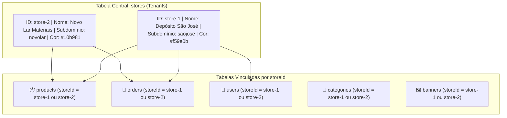
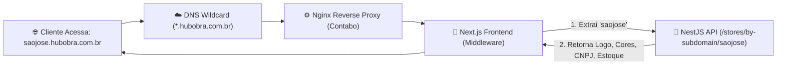

# 🏢 Estudo de Arquitetura SaaS Multi-Loja & White-Label (HubObra Suite)
> **Como empacotar e vender o ecossistema completo (Loja Online, WhatsApp com IA, ERP Balcão/Caixa e App de Expedição) como uma solução SaaS Multi-Tenant para depósitos e lojas de materiais de construção.**

---

## 📌 1. Visão Geral do Produto Comercializável

Você construiu uma suíte tecnológica de alto valor para o mercado de materiais de construção. O objetivo agora é transformá-la em um **produto de assinatura (SaaS B2B)** onde cada cliente contratante (ex: *Depósito São José*, *Novo Lar Materiais*, *Comercial Fortaleza*) tenha seu próprio ambiente exclusivo e personalizado com sua marca.

### O Pacote de Venda do HubObra Suite:
1. **🛒 Loja Virtual E-commerce (Next.js):**
   - Subdomínio próprio (`saojose.hubobra.com.br`) ou domínio próprio (`www.depositosaojose.com.br`).
   - Identidade visual, logotipo, cores, banners e vitrine da loja contratante.
   - Checkout PIX dinâmico e opções de entrega por frete/bairro.
2. **💬 Atendimento WhatsApp Inteligente com IA:**
   - Chatwoot + n8n + IA Lia treinada no catálogo da loja contratante.
   - Envio de orçamentos e recibos formatados com o nome, CNPJ e Chave PIX do contratante.
3. **🏬 ERP HubObra Local-First (Balcão, Caixa e Compras):**
   - Balcão de vendas ágil com comando de voz no fone de ouvido.
   - Caixa Central com fila de emissão de NF-e/NFC-e (SEFAZ-CE).
   - Impressão térmica e matricial de 3 vias com o cabeçalho e CNPJ do contratante.
4. **📦 Aplicativo PWA de Expedição & Conferência:**
   - Separação de pedidos no galpão com leitor de código de barras e baixa de estoque em tempo real.

---

## 🏗️ 2. Arquitetura Multi-Tenant (Isolamento de Dados no Supabase)

O seu banco de dados PostgreSQL no **Supabase** e o ORM **Prisma** no NestJS já possuem a estrutura ideal de **Multi-Tenancy por Coluna Discriminatória (`storeId`)**.

### Como funciona no Banco de Dados:


### Segurança e Isolamento com Row Level Security (RLS):
- No Supabase / PostgreSQL, cada requisição do backend ou do terminal carrega o identificador do contratante (`storeId`).
- A loja do *Depósito São José* **nunca** terá acesso aos produtos, clientes ou faturamento da loja *Novo Lar*.

---

## 🌐 3. Estratégia de Roteamento de Domínios e Subdomínios

Para permitir `saojose.hubobra.com.br`, `novolar.hubobra.com.br` ou domínios próprios:



### 1. DNS Wildcard no Cloudflare / Registro.br:
- Configure uma entrada tipo `CNAME` ou `A`:
  `*.hubobra.com.br` ➔ `IP_DA_SUA_VPS_CONTABO`
- Qualquer novo cliente contratante ganha seu subdomínio instantaneamente sem você precisar criar uma entrada DNS nova!

### 2. Middleware de Resolução no Next.js (`middleware.ts`):
```typescript
// Exemplo de resolução dinâmica de subdomínio no Next.js
export function middleware(req: NextRequest) {
  const host = req.headers.get('host') || '';
  const subdomain = host.split('.')[0]; // ex: 'saojose'

  // Anexa o subdomínio nos headers para a página renderizar com a marca correta
  const requestHeaders = new Headers(req.headers);
  requestHeaders.set('x-store-subdomain', subdomain);

  return NextResponse.next({
    request: { headers: requestHeaders },
  });
}
```

---

## 🎨 4. White-Label Dinâmico (Como o ERP e a Loja se Adaptam)

Quando o contratante entra no sistema, o ecossistema carrega dinamicamente:

| Ponto de Contato | O que muda dinamicamente para o Contratante |
| :--- | :--- |
| **Navbar & Header do ERP** | Logo da empresa contratante, Nome Fantasia (ex: `1 - DEPÓSITO SÃO JOSÉ`) e Filiais |
| **Loja Virtual (Home & Checkout)** | Paleta de cores primárias, banners promocionais, logo e WhatsApp de contato |
| **Recibos Térmicos (58mm/80mm)** | Razão Social, CNPJ, Inscrição Estadual, Endereço e Chave PIX cadastrada |
| **Impressão 3 Vias (Matricial LX-300)** | Cabeçalho personalizado da loja com telefone e mensagem de rodapé |
| **Mensagens do WhatsApp** | *"HUBOBRA - NOVO LAR MATERIAIS DE CONSTRUÇÃO"* + Chave PIX daquela loja específica |
| **Configuração Fiscal Ceará** | Certificado Digital A1, CSC e Token SEFAZ-CE exclusivos da empresa |

---

## 🚀 5. Modelo de Negócio & Precificação Sugerida (SaaS)

| Plano | O que inclui | Mensalidade Sugerida |
| :--- | :--- | :--- |
| **Plano Essencial** | • Loja Virtual com Subdomínio próprio<br/>• ERP Balcão (1 Terminal) + Caixa Central<br/>• Catálogo integrado com fotos e cálculo de frete | **R$ 290,00 / mês** |
| **Plano Profissional** *(Mais Vendido)* | • Loja Virtual + Domínio Próprio (.com.br)<br/>• ERP Completo (Até 5 Vendedores simultâneos com fone/voz)<br/>• Atendimento WhatsApp com IA Lia + Orçamentos 1-Clique<br/>• PWA de Expedição e Separação de Cargas | **R$ 590,00 / mês** |
| **Plano Enterprise** | • Tudo do Profissional<br/>• Módulo Fiscal Completo (Emissão NFC-e / NF-e SEFAZ)<br/>• Múltiplas Filiais / Depósitos<br/>• Treinador de IA exclusivo para a loja | **R$ 990,00 / mês** |

---

## 📋 6. Passo a Passo para Ativar um Novo Cliente em 10 Minutos

Quando uma nova loja fechar contrato com você:

1. **Passo 1 (Criar Tenant no Painel Super Admin):**
   - Acesse o painel Master ➔ Crie a nova loja (ex: `Nome: Novo Lar Materiais`, `Slug: novolar`, `CNPJ: XX.XXX...`, `WhatsApp: 8599...`, `Chave PIX: ...`).
2. **Passo 2 (Subir Catálogo Inicial de Produtos):**
   - Importe a planilha Excel do novo cliente via `/admin/produtos/importar` ou use o Extrator de Concorrentes para popular o estoque com fotos e categorias.
3. **Passo 3 (Entregar Acessos ao Cliente):**
   - **Link da Loja Virtual:** `https://novolar.hubobra.com.br`
   - **Link do ERP / Balcão:** `https://novolar.hubobra.com.br/erp` ou aplicativo desktop/local.
   - **Usuários:** Crie os logins dos vendedores e do caixa com PIN rápido (ex: `1122`, `2233`).
4. **Passo 4 (Configurar o WhatsApp da Loja):**
   - Conecte o número do WhatsApp do cliente no Chatwoot / n8n via QR Code.

---

## 🎯 Conclusão & Próximos Passos
Seu projeto está tecnicamente muito maduro. A base de dados já possui o modelo `Store`, o backend NestJS já possui suporte a `storeId`, o ERP já possui isolamento local e o WhatsApp já formata dinamicamente orçamentos reais.
