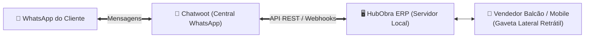

# 📖 Guia Passo a Passo: Integração HubObra ERP + Chatwoot (WhatsApp)

Este documento descreve o passo a passo completo para configurar o **Chatwoot** (Central de Atendimento WhatsApp Multiatendente) integrado à **Gaveta Lateral Retrátil do HubObra ERP**.

---

## 🎯 Objetivo da Integração
* Permitir que os **5 vendedores** atendam clientes no WhatsApp diretamente na tela do ERP sem precisar trocar de janela (`Alt + Tab`).
* Enviar orçamentos formatados, cálculos de materiais e links de pagamento PIX com **1 clique** direto na conversa do cliente.
* Identificar o cliente automaticamente pelo número de telefone (exibindo limite de crediário, tabela de preços e histórico de compras).

---

## 🗺️ Visão Geral da Arquitetura



---

## 📋 PARTE 1: Configuração no Painel do Chatwoot

### 1.1. Cadastrar os 5 Vendedores (Agentes)
1. Acesse seu painel do Chatwoot como Administrador (ex: `https://chat.hubobra.com.br` ou `https://app.chatwoot.com`).
2. No menu lateral esquerdo, clique no ícone de engrenagem **Configurações (Settings)**.
3. Clique em **Agentes (Agents)** e depois no botão **+ Adicionar Agente (+ Add Agent)**.
4. Preencha os dados dos 5 vendedores:
   * **Vendedor 1**: `Carlos Eduardo` — `carlos@hubobra.com.br` (Função: Agente)
   * **Vendedor 2**: `Marcos Vinícius` — `marcos@hubobra.com.br` (Função: Agente)
   * **Vendedor 3**: `Roberto Lima` — `roberto@hubobra.com.br` (Função: Agente)
   * **Vendedor 4**: `Amanda Sousa` — `amanda@hubobra.com.br` (Função: Agente)
   * **Vendedor 5**: `Fernando Costa` — `fernando@hubobra.com.br` (Função: Agente)
5. Cada vendedor receberá um e-mail para cadastrar sua senha de acesso.

---

### 1.2. Conectar o WhatsApp da Loja (Caixa de Entrada / Inbox)
1. No menu **Configurações**, clique em **Caixas de Entrada (Inboxes)** ➔ **+ Adicionar Caixa de Entrada (+ Add Inbox)**.
2. Selecione o canal **WhatsApp** (WhatsApp Cloud API Oficial, Evolution API ou provedor parceiro).
3. Conecte o número de telefone principal da loja: `(85) 99999-8888`.
4. Na etapa **Colaboradores**, selecione todos os 5 vendedores que terão permissão para atender nesse canal.
5. *(Opcional)* Ative a opção **Atribuição Automática (Auto Assignment / Round-Robin)** para que novos clientes que mandarem mensagem sejam distribuídos em rodízio equilibrado entre os vendedores.

---

### 1.3. Obter o Token de Acesso da API (API Access Token)
1. No canto inferior esquerdo do Chatwoot, clique no seu **Avatar / Nome de Perfil** ➔ **Configurações de Perfil (Profile Settings)**.
2. Role a página até o final na seção **Token de Acesso (Access Token)**.
3. Copie o código gerado (ex: `aBcDeF1234567890XYZ...`).
4. Anote também o **ID da sua Conta** (que aparece na URL do navegador, ex: `https://app.chatwoot.com/app/accounts/1/dashboard` ➔ Account ID: `1`).

---

## ⚙️ PARTE 2: Configuração no HubObra ERP

### 2.1. Vincular os E-mails no Cadastro de Usuários
1. No HubObra ERP, entre como Administrador e acesse: **`Administração & Permissões` ➔ `Usuários & Logins`**.
2. Edite cada vendedor e informe o e-mail correspondente cadastrado no Chatwoot:
   * Código `01` (Carlos Eduardo) ➔ `carlos@hubobra.com.br`
   * Código `02` (Marcos Vinícius) ➔ `marcos@hubobra.com.br`
   * Código `03` (Roberto Lima) ➔ `roberto@hubobra.com.br`
   * Código `04` (Amanda Sousa) ➔ `amanda@hubobra.com.br`
   * Código `05` (Fernando Costa) ➔ `fernando@hubobra.com.br`
3. Salve as alterações.

---

### 2.2. Preencher os Parâmetros do Chatwoot no ERP
No arquivo de configuração ou na aba **Configurações ➔ Integrações**:

```json
{
  "chatwoot": {
    "enabled": true,
    "baseUrl": "https://chat.hubobra.com.br",
    "accountId": 1,
    "apiAccessToken": "SEU_TOKEN_DE_ACESSO_AQUI",
    "inboxId": 1,
    "autoOpenDrawerOnIncomingMessage": true,
    "shortcutKey": "Alt+W"
  }
}
```

---

## 💼 PARTE 3: Fluxo de Trabalho do Vendedor no Dia a Dia

```
┌─────────────────────────────────────────────────────────────┬──────────────────────────┐
│  HUBOBRA ERP • BALCÃO VENDEDOR [F4]                         │ 💬 CHATWOOT WHATSAPP     │
├─────────────────────────────────────────────────────────────┼──────────────────────────┤
│ Atendente: Carlos Eduardo (01)                              │ Cliente: Eng. Roberto    │
│ Cliente: Construtora Silva Ltda (CNPJ: 12.345.678/0001-90)  │ WhatsApp: (85) 99888-7766│
│                                                             │                          │
│ [ITEM]                             [QTD]   [VL. UN]  [TOTAL]│ "Carlos, me passa o      │
│ 1. Cimento Poty Todas Obras 50kg    40 SC   R$ 53,90 2.156  │ preço de 40 sacos de     │
│ 2. Argamassa AC-III 20kg Quartzolit 10 SC   R$ 36,90   369  │ cimento e 10 de AC-3"    │
│                                                             ├──────────────────────────┤
│ TOTAL: R$ 2.525,00 | Forma: Boleto 30 Dias                  │ ⚡ AÇÕES RÁPIDAS:         │
│                                                             │ [📲 Inserir no Pedido]   │
│ [F5 Enviar ao Caixa]   [💬 Enviar ao WhatsApp do Chatwoot] ─┼─►[📤 Enviar Orçamento]    │
│                                                             │ [💰 Enviar Chave PIX]    │
└─────────────────────────────────────────────────────────────┴──────────────────────────┘
```

1. **Abrir a Gaveta Lateral**:
   * O vendedor pressiona o atalho **`Alt + W`** ou clica no ícone do WhatsApp no canto direito da tela.
   * O Chatwoot abre na lateral já autenticado na conta do vendedor ativo.
2. **Identificação do Cliente**:
   * Ao clicar na conversa do cliente, o ERP reconhece o número e busca automaticamente os dados cadastrais, limite de crédito e tabela de preços.
3. **Disparo do Orçamento com 1 Clique**:
   * Ao terminar de lançar os itens no balcão ou na calculadora de obras, o vendedor clica em **`[💬 Enviar ao WhatsApp do Chatwoot]`**.
   * O Chatwoot envia automaticamente o texto diagramado com valores e link para o cliente aprovar!

---

## 🔧 Referência Técnica: Exemplo de Disparo via API REST

Quando o vendedor clica no botão de envio, o HubObra ERP executa uma chamada HTTP segura para o Chatwoot:

```http
POST https://chat.hubobra.com.br/api/v1/accounts/1/conversations/{CONVERSATION_ID}/messages
Content-Type: application/json
api_access_token: SEU_TOKEN_AQUI

{
  "content": "Olá, Engenheiro Roberto! Segue seu orçamento da HubObra:\n\n1. 40 SC x Cimento Poty 50kg = R$ 2.156,00\n2. 10 SC x Argamassa AC-III 20kg = R$ 369,00\n\n*TOTAL: R$ 2.525,00*\nCondição: Boleto 30 Dias Faturado.\n\nPodemos confirmar a entrega no canteiro?",
  "message_type": "outgoing",
  "private": false
}
```

---

## ❓ Perguntas Frequentes (FAQ)

#### 1. Preciso instalar algum aplicativo pesado nos computadores dos vendedores?
* **Não**. Como o HubObra e o Chatwoot rodam via Web/Local-First, basta o navegador de internet (Chrome, Edge ou Safari).

#### 2. Os vendedores conseguem ver as conversas uns dos outros?
* O Chatwoot permite configurar para que cada vendedor **veja apenas as suas próprias conversas atribuídas**, garantindo privacidade de clientes e carteiras.

#### 3. E se a internet da loja oscilar temporariamente?
* O HubObra ERP continua vendendo no balcão 100% normalmente (Local-First). Assim que a conexão de internet estabilizar, as mensagens do WhatsApp voltam a ser sincronizadas.

---

> **Documento gerado em:** 01/10/2026  
> **Sistema:** HubObra ERP v2.6 & Chatwoot Integration Hub
