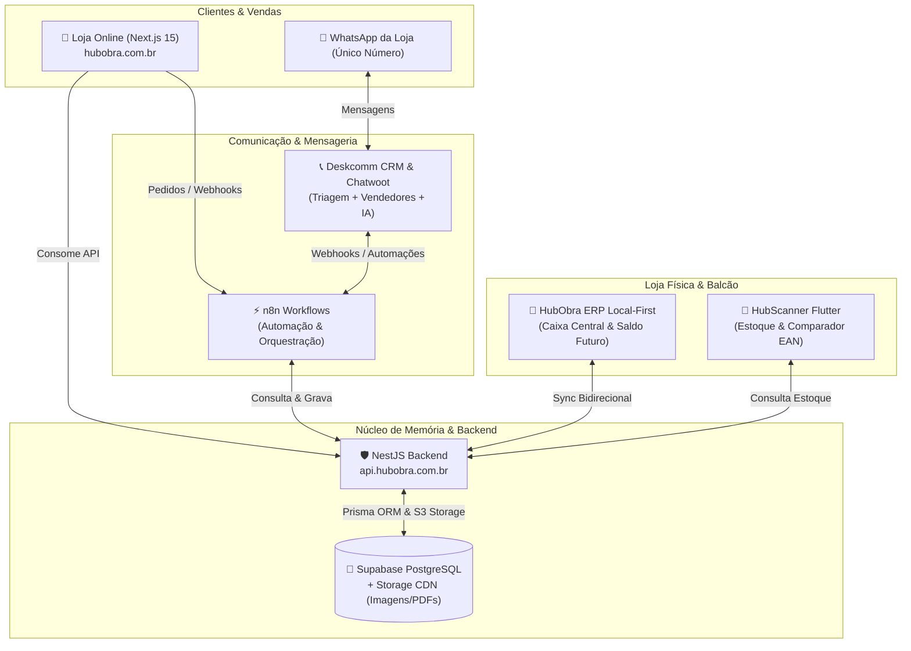

claude# 🧭 HubObra: Guia Mestre e Mapa do Negócio para IAs & Desenvolvedores

> **Documento Oficial de Handoff & Arquitetura de Negócio**  
> **Objetivo:** Fornecer a qualquer Inteligência Artificial ou desenvolvedor o entendimento pleno do **propósito comercial**, dos **pilares da solução**, de **onde os arquivos estão hospedados**, de **como cada módulo se comunica** e de **como realizar alterações com segurança**.

---

## 🎯 1. O que é o Projeto? (Objetivo do Negócio)

O **HubObra** é um ecossistema integrado de tecnologia desenhado especificamente para o setor de **Lojas e Depósitos de Materiais de Construção** (com regras fiscais e logísticas adaptadas à realidade brasileira e regional, como o Ceará).

### O Problema que ele Resolve:
1. **Vendas físicas e digitais unificadas:** Lojas de materiais vendem muito por balcão e WhatsApp, mas perdem pedidos por falta de catálogo online com preços e medidas da construção civil (milheiro, m², m³, sacos, barras).
2. **Saldo de Obra / Retirada Futura (`FUTURE_PICKUP`):** Na construção civil, mestres de obra e construtoras compram 200 sacos de cimento de uma vez para travar o preço de atacado, mas retiram aos poucos durante semanas. O sistema gerencia esse saldo sem dar baixa indevida no galpão no momento do pagamento.
3. **Atendimento Omnichannel via WhatsApp único:** Vendedores, operadores de balcão e assistentes virtuais de IA conversam com clientes através de um único número da empresa.

---

## 🏛️ 2. Os 5 Pilares do Ecossistema HubObra

---

## 🛒 3. Loja Online (Storefront & Admin)

### O que faz?
- **Para o cliente:** Catálogo de materiais de construção, cálculo por unidades de obra (m², saco, un, barra), busca inteligente, checkout com PIX nativo e geração de **Recibo A4 / PDF diagramado para WhatsApp**.
- **Para o lojista (`/admin`):** Gestão de produtos, controle de estoque, banners promocionais, monitoramento e o módulo exclusivo de **Gestão e Reajuste em Lote de Preços** com exportação Excel (`.xlsx`).
- **Para a expedição (`/expedicao`):** PWA com checklist tátil para conferência e despacho de caminhões de entrega.

### Onde estão os arquivos?
- **Código-fonte:** Diretório local [`frontend/`](file:///f:/Apps/Projeto%20Loja%20Moderna/frontend)
- **Hospedagem em Produção:** VPS Contabo (`161.97.122.119`), container Docker Swarm gerenciado pelo Easypanel sob o serviço `n8n_frontend`.
- **Domínios:** `https://hubobra.com.br` e `https://www.hubobra.com.br` (protegidos via Cloudflare).

### Como funciona a conexão?
- **Server-Side Rendering (SSR):** O Next.js se conecta internamente com a API NestJS via Docker network (`http://tasks.n8n_api:8081` ou `http://n8n_api:8081`) através do [`frontend/src/lib/backend-client.ts`](file:///f:/Apps/Projeto%20Loja%20Moderna/frontend/src/lib/backend-client.ts).
- **Client-Side (Navegador):** Requisições diretas do navegador usam o proxy interno `/api/*` do Next.js ou `https://api.hubobra.com.br`.

### Como fazer modificações?
1. Edite os componentes em `frontend/src/app/` (páginas) ou `frontend/src/components/`.
2. Teste localmente com `npm run dev` dentro de `frontend/`.
3. Valide o build com `npm run build`.
4. Envie as alterações para o GitHub na branch `main` (`git push origin main`). O Easypanel detecta ou compila o novo container pelo botão **Implantar**.

---

## ⚡ 4. n8n (Orquestrador de Automação & Workflows)

### O que faz?
É o **cérebro integrador** de eventos do ecossistema:
- **Disparo de Pedidos:** Quando um pedido é fechado na Loja Online, o n8n recebe o webhook, gera o resumo formatado e notifica a equipe e o cliente no WhatsApp.
- **Agentes de IA (Lia Multimodal & Zé da Obra):** Processa áudios do WhatsApp via Gemini Studio TTS, faz a triagem de orçamentos e responde com cotações formatadas.
- **Sincronização com ERPs Externos:** Faz ponte entre o banco de dados e sistemas como GestãoClick para manter preços e saldos alinhados.

### Onde estão os arquivos e fluxos?
- **Workflows no Repositório:** [`n8n_current_lia_workflow.json`](file:///f:/Apps/Projeto%20Loja%20Moderna/n8n_current_lia_workflow.json) e [`N8N_WORKFLOW_LIA_MULTIMODAL.json`](file:///f:/Apps/Projeto%20Loja%20Moderna/N8N_WORKFLOW_LIA_MULTIMODAL.json).
- **Execução em Produção:** Container Docker Swarm na VPS Contabo (`n8n_n8n`), acessível pelo painel web do n8n.

### Como se comunica?
- Recebe requisições via **Webhooks HTTP POST**.
- Faz requisições HTTP REST diretas na API do HubObra (`http://n8n_api:8081` ou `https://api.hubobra.com.br`) e no Deskcomm/Chatwoot.

### Como fazer modificações?
1. No painel visual do n8n, altere os nós e teste o fluxo.
2. Exporte o fluxo em formato JSON.
3. Salve o JSON atualizado na raiz do repositório para versionamento no Git.

---

## 🏢 5. HubObra ERP Local-First (Caixa Central & Balcão Físico)

### O que faz?
É a aplicação do caixa e balcão da loja física:
- **Operação Offline-First:** Não para de faturar se a internet cair. Utiliza banco de dados no navegador (IndexedDB via Dexie.js).
- **Caixa Central com Diferenciação Cromática:**
  - *Card Amarelo / Dourado Âmbar:* Pedidos com **Saldo de Retirada Futura** (`FUTURE_PICKUP`). Recebe o dinheiro no caixa, mas **bloqueia a saída física do caminhão**.
  - *Card Padrão:* Vendas de balcão para entrega ou retirada imediata.
- **Conferência de Carga:** Registra assinaturas e baixas parciais de saldo.

### Onde estão os arquivos?
- **Código-fonte:** Diretório local [`hubobra-erp/`](file:///f:/Apps/Projeto%20Loja%20Moderna/hubobra-erp) (construído com React + Vite + TypeScript).
- **Execução na Loja:** Pode rodar em rede local no computador do caixa via [`iniciar-servidor-hubobra.bat`](file:///f:/Apps/Projeto%20Loja%20Moderna/hubobra-erp/iniciar-servidor-hubobra.bat) ou ser empacotado para a web.

### Como se comunica?
- Opera de forma autônoma offline.
- Quando online, sincroniza deltas de vendas, produtos e estoque com o **Backend NestJS** via chamadas REST (`/api/products`, `/api/orders`).

### Como fazer modificações?
1. Altere as telas em `hubobra-erp/src/`.
2. Execute `npm run dev` na pasta `hubobra-erp` para testar.
3. Compile para produção com `npm run build`.

---

## 🐘 6. Supabase (Banco de Dados Geral & Armazenamento de Imagens)

### O que faz?
É a **fonte única da verdade** do ecossistema:
- **Banco Relacional PostgreSQL:** Guarda todos os dados estruturados (produtos, variações, categorias, preços de custo e venda, pedidos, clientes, histórico de auditoria e configurações multi-loja).
- **Supabase Storage (CDN S3):** Armazena todas as fotos em alta resolução dos produtos, banners promocionais e recibos em PDF, servindo arquivos com URLs públicas otimizadas.
- **Connection Pooler:** Permite conexões simultâneas da API NestJS sem esgotar o limite de conexões do banco de dados (porta 6543 via Transaction Mode).

### Onde estão os modelos e esquemas?
- **Schema Prisma:** Localizado em [`backend-nestjs/prisma/schema.prisma`](file:///f:/Apps/Projeto%20Loja%20Moderna/backend-nestjs/prisma/schema.prisma).

### Como se comunica?
- A API NestJS conecta-se ao Supabase através do Prisma ORM (`DATABASE_URL` para queries normais e `DIRECT_URL` para migrações).
- O Frontend e os clientes consomem as imagens diretamente via URL pública do bucket Supabase Storage.

### Como fazer modificações?
1. Altere o arquivo `backend-nestjs/prisma/schema.prisma`.
2. Para aplicar alterações estruturais, gere a migração com `npx prisma migrate dev` ou atualize o cliente com `npx prisma generate`.
3. Nunca altere tabelas diretamente no painel web sem sincronizar o schema no Git.

---

## 📞 7. Deskcomm (CRM de Atendimento & WhatsApp Unificado)

### O que faz?
Centraliza a comunicação com clientes e funcionários em um **único número oficial de WhatsApp da loja**:
- **Atendimento Multiatendente:** Vários funcionários (vendas, caixa, expedição) atendem conversas simultaneamente sem precisar de vários celulares.
- **Integração com ERP:** O operador de vendas consulta clientes, orçamentos e pedidos diretamente na interface de atendimento.
- **Handoff Humano ↔ IA:** O cliente inicia o contato conversando com a IA (*Lia* no n8n) para tirar dúvidas de obras ou calcular quantidades. Se desejar fechar a compra ou negociar, o fluxo transfere a conversa suavemente para um atendente humano no Deskcomm.

### Onde estão os arquivos?
- **Código-fonte:** Diretório local [`deskcomm-crm/`](file:///f:/Apps/Projeto%20Loja%20Moderna/deskcomm-crm) (Next.js full-stack com arquitetura de extensões e integrações de mensagens).

### Como se comunica?
- Conecta-se às APIs de WhatsApp (Uazapi, Z-API ou Evolution API).
- Emite e escuta webhooks trocados com o **n8n** e a API NestJS para sincronizar o status das negociações.

### Como fazer modificações?
1. Verifique as configurações em `deskcomm-crm/`.
2. As regras de roteamento de atendimento e webhooks de entrada ficam configuradas em conjunto com os nós do n8n.

---

## 🛠️ 8. Backend NestJS (O Coração da Lógica de Negócio)

### O que faz?
Concentra toda a inteligência e regras de negócio que alimentam Loja, ERP, Deskcomm e App Mobile:
- Autenticação JWT e controle de papéis (`ADMIN`, `STORE_ADMIN`, `EXPEDITION`, `USER`).
- **Robô Extrator de Concorrentes:** Scraping em tempo real de grandes redes (Acal, Normatel, Carajás, Obramax, Leroy Merlin) em [`extractor.service.ts`](file:///f:/Apps/Projeto%20Loja%20Moderna/backend-nestjs/src/products/extractor.service.ts).
- Gestão de Preços em lote e geração de planilhas Excel.
- Endpoints de Saúde e Diagnóstico em [`health.controller.ts`](file:///f:/Apps/Projeto%20Loja%20Moderna/backend-nestjs/src/health/health.controller.ts).

### Onde estão os arquivos?
- **Código-fonte:** Diretório local [`backend-nestjs/`](file:///f:/Apps/Projeto%20Loja%20Moderna/backend-nestjs)
- **Hospedagem em Produção:** VPS Contabo (`161.97.122.119`), container Docker Swarm `n8n_api` na porta `8081`.
- **Domínio:** `https://api.hubobra.com.br`

---

## 📋 Resumo das Portas e Rotas Críticas

| Serviço | Diretório Local | Hospedagem Produção | Porta | URL Externa / Acesso |
|---|---|---|---|---|
| **Loja (Next.js)** | `frontend/` | Docker Swarm (`n8n_frontend`) | 3000 | `https://hubobra.com.br` |
| **API (NestJS)** | `backend-nestjs/` | Docker Swarm (`n8n_api`) | 8081 | `https://api.hubobra.com.br` |
| **n8n** | Workflows `.json` | Docker Swarm (`n8n_n8n`) | 5678 | Painel interno n8n |
| **ERP Balcão** | `hubobra-erp/` | Rede Local / Navegador | 5173 / Local | `iniciar-servidor-hubobra.bat` |
| **Deskcomm CRM** | `deskcomm-crm/` | Sub-serviço / Caddy | Config | Central WhatsApp da Loja |
| **Banco / CDN** | Schema em `prisma/` | Supabase Cloud | 6543 / 443 | PostgreSQL + CDN S3 |

---

## 💡 Diretrizes para Qualquer IA que for Trabalhar no Projeto:

1. **Entenda o Domínio:** Materiais de construção possuem particularidades fiscais, de medidas (sacos, barras, m²) e de retirada futura que não existem em e-commerces comuns.
2. **Respeite a Separação de Camadas:**
   - Visual e experiência do cliente → `frontend/`
   - Regras comerciais, cálculos e banco de dados → `backend-nestjs/`
   - Automações de mensagens e robôs de WhatsApp → `n8n`
   - Venda física e caixa sem internet → `hubobra-erp/`
   - Atendimento multi-humano no WhatsApp → `deskcomm-crm/`
3. **Produção e Resiliência:** Todo deploy deve priorizar o tempo de atividade da loja online (zero-downtime). Consulte sempre o guia operacional [`CONTEXTO_PARA_IA.md`](file:///f:/Apps/Projeto%20Loja%20Moderna/CONTEXTO_PARA_IA.md) para detalhes de infraestrutura e roteamento da VPS.
