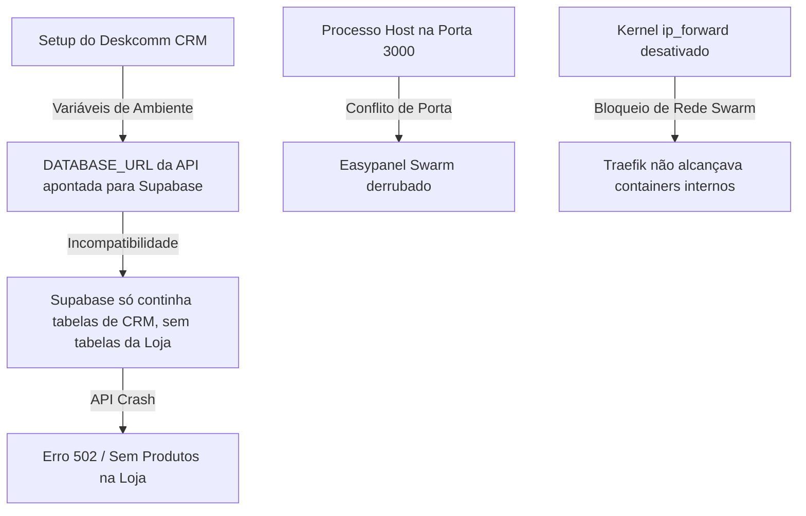
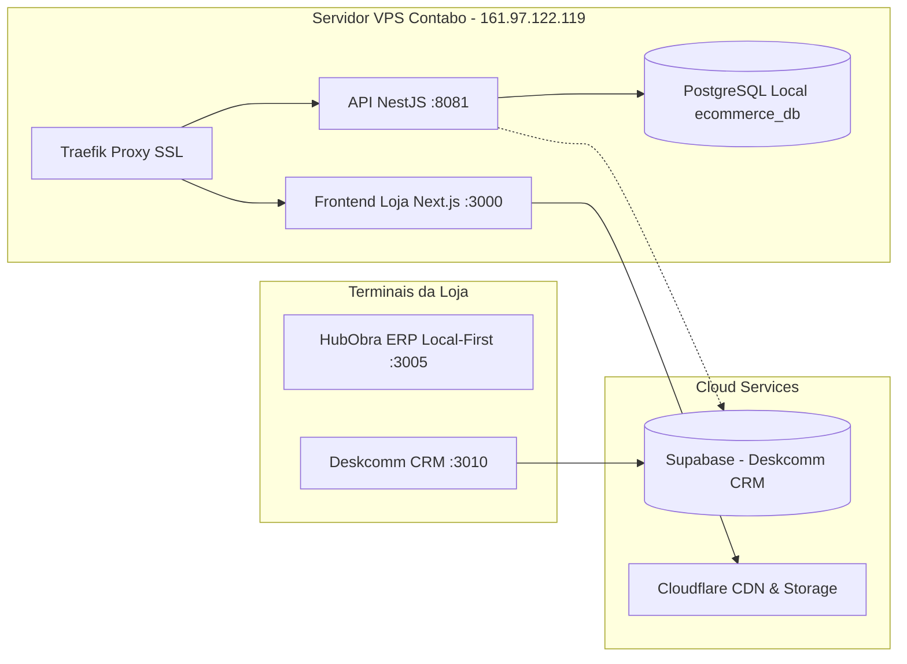

# 📋 GUIA DE PÓS-MORTEM, PREVENÇÃO E RECUPERAÇÃO RÁPIDA (RUNBOOK)
## Ecossistema HubObra: Loja Virtual, Deskcomm CRM e ERP

---

## 1. 🔍 O Que Aconteceu? (Análise Detalhada da Causa Raiz)

Durante os testes de integração e configuração do **Deskcomm CRM**, a loja virtual (`hubobra.com.br`) e a API (`api.hubobra.com.br`) apresentaram instabilidade (Erros Cloudflare 502 Bad Gateway e 521 Web Server Is Down).

### As 3 Causas Raízes Identificadas:



1. **Conflito de Bancos de Dados (Loja vs CRM Supabase):**
   - A API NestJS da loja teve sua variável `DATABASE_URL` configurada para o banco do **Supabase** (`zeywqzkmevytzkdbzwni.supabase.co`).
   - O Supabase continha a estrutura do **Deskcomm CRM** (mais de 190 tabelas de leads, contatos, mensagens de WhatsApp e agentes de IA), mas **não possuía as tabelas da loja virtual** (`products`, `categories`, `product_images`, etc.).
   - Quando a API tentava buscar os produtos, ocorria erro fatal `The table public.products does not exist`.

2. **Conflito de Porta no Host VPS (Porta 3000):**
   - Um processo Node/Next avulso rodando direto no sistema operacional da VPS ocupou a porta `3000/tcp`, impedindo o serviço principal do **Easypanel** de subir e gerando erro 521.

3. **Bloqueio de Roteamento de Rede no Docker Swarm:**
   - O kernel do Linux na VPS estava com o encaminhamento de pacotes (`net.ipv4.ip_forward`) desativado, o que impedia os Virtual IPs (VIPs) da rede overlay do Docker Swarm de rotear tráfego entre o Traefik, o Frontend e a API.

---

## 2. 🛡️ O Que Foi Feito para Solucionar Definitivamente?

1. **Separação e Isolamento dos Bancos de Dados:**
   - Criada a base dedicada **`ecommerce_db`** no PostgreSQL local do servidor (`atendimento-chatwoot-db`).
   - A API NestJS (`n8n_api`) agora se conecta a este banco local com **latência inferior a 1ms**.
   - O **Supabase** permanece 100% focado e isolado para o **Deskcomm CRM**.

2. **Ativação Permanente do Roteamento de Rede no Linux:**
   - Executado `sysctl -w net.ipv4.ip_forward=1` e gravado de forma definitiva no `/etc/sysctl.conf`.
   - Configurado `--endpoint-mode dnsrr` nos serviços do Swarm para garantir resolução DNS direta entre containers.

3. **Restauração e Importação Integral do Catálogo:**
   - Executada a carga estruturada de todos os **166 produtos oficiais**, com categorias, preços, SKUs e fotos em alta resolução.

---

## 3. 🚫 O Que Fazer Para NUNCA Mais Acontecer? (Boas Práticas)

| Regra de Ouro | Ação Obrigatória |
| :--- | :--- |
| **1. Nunca misturar `DATABASE_URL`** | O e-commerce usa `ecommerce_db` local. O Deskcomm CRM usa o Supabase. Nunca aponte a API da loja para o Supabase sem rodar as migrations específicas. |
| **2. Não rodar servidores avulsos no Host** | Todo serviço na VPS deve rodar em containers Docker gerenciados pelo Easypanel/Swarm, nunca com `node`, `npm` ou `pm2` direto no terminal do root. |
| **3. Backup Diário do Postgres Local** | Manter dump diário automático do `ecommerce_db` (script abaixo). |
| **4. Validar antes de reiniciar serviços** | Ao alterar variáveis de ambiente no Easypanel, verificar se o container subiu com status `running`. |

---

## 4. ⚡ RUNBOOK: Guia de Recuperação Ultrarrápida (Se Acontecer Alguma Falha)

Se a loja virtual ou API apresentar qualquer instabilidade no futuro, siga este passo a passo de **3 minutos**:

### Passo 1: Verificar se os serviços estão rodando
No terminal SSH da VPS (`161.97.122.119`), execute:
```bash
docker service ls
```
*Todos os serviços devem mostrar `1/1` (ex: `n8n_frontend 1/1`, `n8n_api 1/1`, `atendimento_chatwoot-db 1/1`).*

---

### Passo 2: Se a API der Erro 502 / Queda de Banco
Basta rodar o comando de reconexão e sincronização rápida:
```bash
# 1. Garantir que as tabelas existem no Postgres local
docker exec $(docker ps -q -f name=n8n_api | head -n 1) npx prisma db push --accept-data-loss

# 2. Reiniciar o serviço da API
docker service update --force n8n_api
```

---

### Passo 3: Se o Easypanel ou Traefik Travar (Erro 521)
```bash
# Liberar porta 3000 caso algum processo tenha travado
fuser -k 3000/tcp 2>/dev/null || true

# Garantir roteamento de rede ativo
sysctl -w net.ipv4.ip_forward=1
iptables -P FORWARD ACCEPT

# Reiniciar Easypanel e Traefik
docker service update --force easypanel
docker service update --force easypanel-traefik
```

---

### Passo 4: Backup e Restauração em 1 Linha

#### Para fazer backup agora:
```bash
docker exec $(docker ps -q -f name=atendimento_chatwoot-db | head -n 1) pg_dump -U postgres ecommerce_db > /root/backup_ecommerce_$(date +%F).sql
```

#### Para restaurar o backup em caso de desastre:
```bash
cat /root/backup_ecommerce_*.sql | docker exec -i $(docker ps -q -f name=atendimento_chatwoot-db | head -n 1) psql -U postgres -d ecommerce_db
docker service update --force n8n_api
```

---

## 5. 🗺️ Arquitetura Consolidada do Ecossistema



*Documento gerado e integrado ao repositório em 04/10/2026.*
