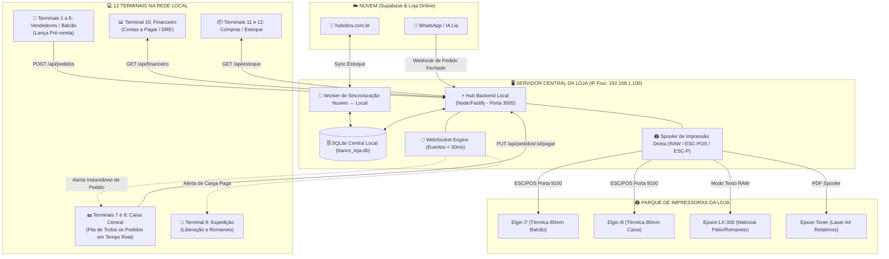

# 📋 Plano de Arquitetura: Servidor Central Local e Instalador Multi-Terminais (HubObra ERP)

> **Data:** 2026-10-07  
> **Status:** PLANEJADO & PRONTO PARA IMPLEMENTAÇÃO  
> **Escopo:** 1 Servidor Central + 12 Terminais em Rede Local + 4 Impressoras (Elgin i7, i9, Epson LX-300, Epson Toner)  

---

## 1. Diagnóstico do Desafio Técnico

### O Cenário Real
- **13 Computadores na Rede da Loja:**
  - 1 Servidor Central (hospeda dados, banco e orquestração).
  - 12 Terminais distribuídos por setores:
    - **Vendedores (Balcão):** Criação rápida de pré-vendas e orçamentos.
    - **Caixa Central:** Recebimento unificado de **todos os pedidos** (Balcão + IA WhatsApp).
    - **Expedição:** Conferência de carga, romaneio e "Saldo de Obra / Retirada Futura".
    - **Financeiro:** Backoffice, contas a pagar, conciliação e relatórios (sem receber dinheiro físico).
    - **Compras:** Reposição de estoque e cotações.
- **4 Impressoras Especializadas em Rede:**
  - **Elgin i7:** Cupom térmico 80mm no Balcão/Caixa (ESC/POS).
  - **Elgin i9:** Cupom térmico 80mm de alta velocidade no Caixa (ESC/POS).
  - **Epson LX-300:** Matricial contínua para romaneio de carga em 2/3 vias (ESC/P RAW Text).
  - **Epson Toner:** Laser/Toner A4 para relatórios, boletos e DANFE.

### A Limitação do IndexedDB Isolado
Atualmente, o frontend do `hubobra-erp` grava dados no `Dexie` (IndexedDB) dentro do navegador da máquina que o acessa. Se a máquina do Vendedor grava no navegador dela, o Caixa (em outra máquina) **não tem acesso direto ao IndexedDB do vendedor**.
👉 **Conclusão:** É indispensável um **Servidor Backend Local Ultraleve** rodando no Servidor Central da loja para centralizar as vendas, sincronizar com os 12 terminais em tempo real via **WebSockets**, gerenciar a fila do Caixa e disparar as impressões.

---

## 2. Topologia da Arquitetura Cliente-Servidor



---

## 3. O Fluxo de Comunicação em Tempo Real Vendedor / IA ➔ Caixa

1. **Vendedor cria pré-venda:**
   - Adiciona produtos no balcão (`POST /api/orders`).
   - Servidor salva no SQLite local e emite no WebSocket:
     ```json
     {
       "event": "NEW_ORDER",
       "data": {
         "orderNumber": "1042",
         "origin": "BALCAO",
         "sellerName": "Marcos",
         "total": 350.00,
         "itemsCount": 4
       }
     }
     ```
2. **Caixa recebe em < 30ms:**
   - Tela do Caixa apita discretamente e exibe o cartão `#1042 - Marcos - R$ 350,00` no topo da fila.
   - O cliente se desloca até o Caixa.
3. **Pedidos da IA no WhatsApp:**
   - A IA fecha o pedido no WhatsApp via n8n e envia para o Servidor Local (`POST /api/orders` com `origin: "LIA_AI"`).
   - O Caixa vê o pedido com o selo visual 🤖 `[WhatsApp / IA]`.
4. **Baixa e Despacho:**
   - Caixa recebe o valor e clica em **"Confirmar Pagamento & Imprimir"**.
   - Servidor dispara cupom na **Elgin i9** e notifica o terminal da **Expedição**.
   - Expedição confere e imprime o romaneio contínuo na **Epson LX-300**.

---

## 4. Estrutura do Sistema Instalador (`Setup-HubObra-ERP.exe`)

Criado com **Inno Setup** (ferramenta padrão para instaladores Windows, com interface nativa em português e alta confiabilidade):

### Tela 1: Escolha do Modo de Instalação
O assistente pergunta com caixas de seleção:
- 🔘 **Instalar como SERVIDOR CENTRAL DA LOJA (Master)**
  * Apenas para o computador principal.
  * Instala:
    1. Pacote compilado do ERP (`dist/`).
    2. Serviço local da API e WebSockets (porta `3005`).
    3. Banco de dados SQLite local (`banco_loja.db`).
    4. Módulo de spooler de impressão de rede.
  * Executa automaticamente:
    * Liberação de porta no Firewall do Windows (`netsh advfirewall`).
    * Configuração de inicialização automática no Windows (`shell:startup`).
  * Mostra no final uma tela com o **IP da máquina na rede** (ex: `http://192.168.1.100:3005`) para usar nos outros 12 computadores.

- 🔘 **Instalar como TERMINAL DE TRABALHO (Estação Escrava)**
  * Para os 12 outros computadores.
  * Pede:
    * **IP do Servidor:** `[ 192.168.1.100 ]` (com botão de testar conexão).
    * **Setor desta Máquina:**
      * `[ ] Vendedor / Balcão`
      * `[ ] Caixa Central`
      * `[ ] Expedição`
      * `[ ] Financeiro / Gestão`
      * `[ ] Compras`
    * **Impressora Padrão do Terminal:** Seleciona entre as impressoras instaladas no Windows ou IP de rede.
  * Cria o atalho no Desktop com o ícone oficial da loja abrindo em **Modo Janela/App (sem barra de URL)** apontando direto para o setor selecionado.

---

## 5. Módulo Especializado de Impressão por Hardware

| Impressora | Protocolo / Modo | Como o Sistema Envia | Formato |
|---|---|---|---|
| **Elgin i7 / i9** | ESC/POS térmico 80mm | TCP direto na porta 9100 ou spooler RAW do Windows | Linhas de texto, negrito, corte automático de guilhotina (`GS V 0`) |
| **Epson LX-300** | ESC/P Matricial (Modo Texto RAW) | Spooler RAW com driver Genérico/Somente Texto | Formulário contínuo picotado, impressão ultra-rápida (3 segundos), sem borrado |
| **Epson Toner** | Driver Gráfico Padrão Windows | Web Print / PDF Viewer | Relatórios A4, DRE, DANFE e boletos bancários |

---

## 6. Fases de Execução

- [ ] **Fase 1 (Backend Local do Servidor):** Criar `server/` em Node.js com SQLite local, rotas REST de pedidos e WebSockets para a fila do Caixa em tempo real.
- [ ] **Fase 2 (Integração no Frontend):** Adaptar o `hubobra-erp` para consultar o Servidor Local quando conectado em rede (mantendo fallback offline).
- [ ] **Fase 3 (Módulo de Spooler de Impressão):** Implementar os drivers de disparo para Elgin i7/i9 (ESC/POS) e Epson LX-300 (RAW ESC/P).
- [ ] **Fase 4 (Script do Instalador Inno Setup):** Criar o script `.iss` e compilar o instalador `.exe` com os perfis de Servidor e Terminal.
