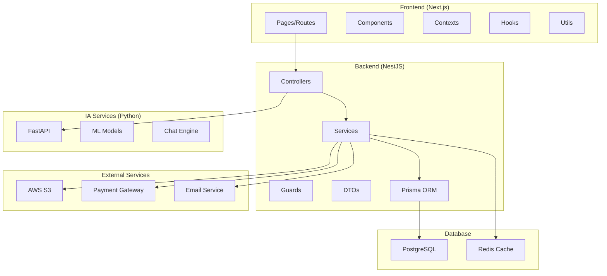
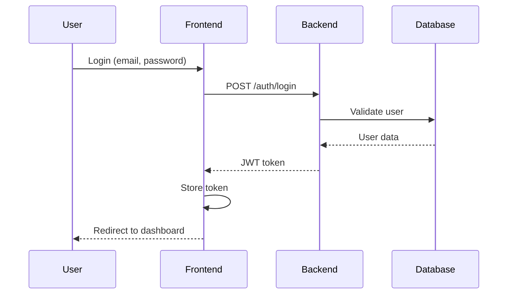
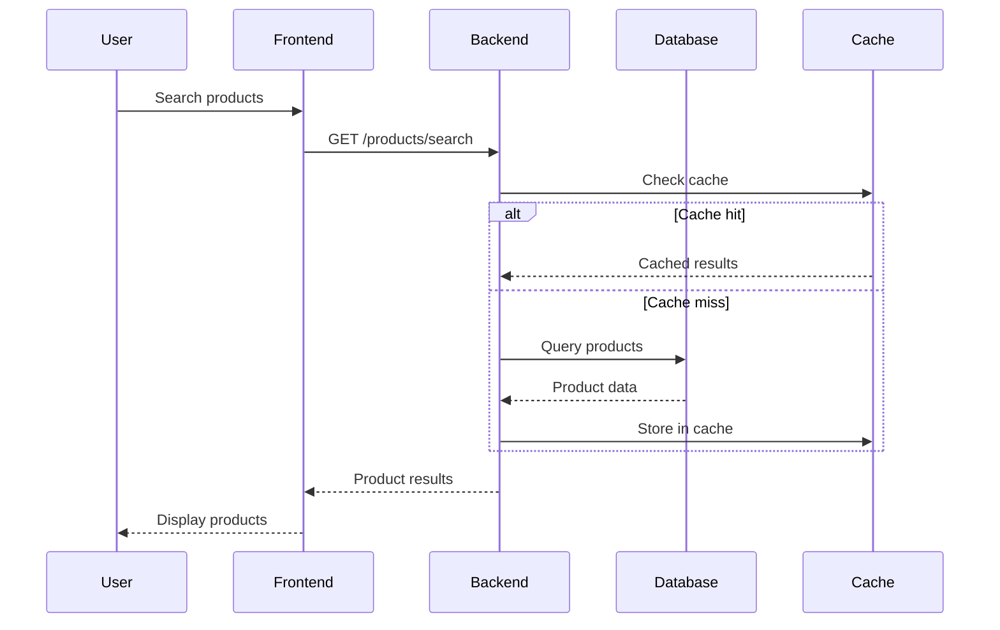

# Arquitetura do Projeto - E-commerce Materiais de Construção

## Visão Geral da Arquitetura

Este projeto implementa uma arquitetura moderna de e-commerce com separação clara entre frontend, backend e serviços de IA, seguindo princípios de microsserviços e design orientado a domínio.



## Stack Tecnológica

### Frontend
- **Framework:** Next.js 14 com App Router
- **Linguagem:** TypeScript
- **Estilização:** Tailwind CSS
- **Estado:** React Context API + Hooks
- **Validação:** Zod
- **Testes:** Jest + Testing Library
- **Build:** Webpack (via Next.js)

### Backend
- **Framework:** NestJS
- **Linguagem:** TypeScript
- **ORM:** Prisma
- **Autenticação:** JWT + Passport
- **Validação:** class-validator
- **Documentação:** Swagger/OpenAPI
- **Testes:** Jest + Supertest

### IA Services
- **Framework:** FastAPI
- **Linguagem:** Python 3.10+
- **ML:** scikit-learn, TensorFlow
- **NLP:** spaCy, transformers
- **Vector DB:** Pinecone/Weaviate

### Database & Cache
- **Principal:** PostgreSQL
- **Cache:** Redis
- **Search:** Elasticsearch (futuro)
- **Files:** AWS S3

## Estrutura de Diretórios

```
projeto/
├── frontend/                 # Aplicação Next.js
│   ├── src/
│   │   ├── app/             # App Router (Next.js 13+)
│   │   │   ├── (auth)/      # Grupo de rotas autenticadas
│   │   │   ├── admin/       # Painel administrativo
│   │   │   ├── api/         # API Routes (se necessário)
│   │   │   ├── components/  # Componentes React
│   │   │   ├── contexts/    # Context Providers
│   │   │   ├── hooks/       # Custom Hooks
│   │   │   └── utils/       # Utilitários
│   │   └── public/          # Assets estáticos
│   └── package.json
│
├── backend-nestjs/          # API NestJS
│   ├── src/
│   │   ├── auth/           # Módulo de autenticação
│   │   ├── users/          # Gestão de usuários
│   │   ├── products/       # Gestão de produtos
│   │   ├── categories/     # Gestão de categorias
│   │   ├── orders/         # Gestão de pedidos
│   │   ├── cart/           # Carrinho de compras
│   │   ├── banners/        # Sistema de banners
│   │   ├── upload/         # Upload de arquivos
│   │   └── common/         # Utilitários compartilhados
│   ├── prisma/             # Schema e migrações
│   └── package.json
│
├── ia/                     # Serviços de IA
│   ├── main.py            # FastAPI app
│   ├── models/            # Modelos ML
│   ├── services/          # Lógica de negócio IA
│   └── requirements.txt
│
├── docs/                  # Documentação
├── infra/                 # Configurações DevOps
└── package.json           # Scripts do projeto
```

## Padrões Arquiteturais

### 1. Frontend - Component-Based Architecture

#### Estrutura de Componentes
```
components/
├── ui/                    # Componentes base (Button, Input, etc.)
├── layout/               # Componentes de layout
├── forms/                # Componentes de formulário
├── business/             # Componentes de negócio
└── pages/                # Componentes de página
```

#### Context Pattern
```typescript
// Exemplo: FavoritesContext
interface FavoritesContextType {
  favorites: Product[];
  addToFavorites: (product: Product) => void;
  removeFromFavorites: (id: string) => void;
  isFavorite: (id: string) => boolean;
}

export const FavoritesProvider = ({ children }) => {
  // Lógica do contexto
  return (
    <FavoritesContext.Provider value={value}>
      {children}
    </FavoritesContext.Provider>
  );
};
```

### 2. Backend - Modular Architecture

#### Estrutura de Módulos
```typescript
// Exemplo: ProductsModule
@Module({
  imports: [PrismaModule],
  controllers: [ProductsController],
  providers: [ProductsService],
  exports: [ProductsService],
})
export class ProductsModule {}
```

#### Service Layer Pattern
```typescript
@Injectable()
export class ProductsService {
  constructor(private prisma: PrismaService) {}

  async findAll(filters: ProductFilters): Promise<Product[]> {
    return this.prisma.product.findMany({
      where: this.buildWhereClause(filters),
      include: { category: true, images: true },
    });
  }
}
```

### 3. Database - Repository Pattern

#### Prisma Schema
```prisma
model Product {
  id          String   @id @default(cuid())
  name        String
  description String?
  price       Float
  stock       Int
  sku         String   @unique
  categoryId  String
  category    Category @relation(fields: [categoryId], references: [id])
  images      ProductImage[]
  createdAt   DateTime @default(now())
  updatedAt   DateTime @updatedAt
}
```

## Fluxo de Dados

### 1. Fluxo de Autenticação


### 2. Fluxo de Busca de Produtos


## Segurança

### 1. Autenticação e Autorização
```typescript
// JWT Guard
@Injectable()
export class JwtAuthGuard extends AuthGuard('jwt') {
  canActivate(context: ExecutionContext): boolean {
    return super.canActivate(context);
  }
}

// Role Guard
@Injectable()
export class RolesGuard implements CanActivate {
  canActivate(context: ExecutionContext): boolean {
    const requiredRoles = this.reflector.get<Role[]>('roles', context.getHandler());
    const user = context.switchToHttp().getRequest().user;
    return requiredRoles.some(role => user.roles?.includes(role));
  }
}
```

### 2. Validação de Dados
```typescript
// DTO com validação
export class CreateProductDto {
  @IsString()
  @IsNotEmpty()
  name: string;

  @IsNumber()
  @Min(0)
  price: number;

  @IsString()
  @IsOptional()
  description?: string;
}
```

## Performance

### 1. Frontend Optimizations
- **Code Splitting:** Componentes carregados sob demanda
- **Image Optimization:** Next.js Image component
- **Caching:** SWR para cache de dados
- **Memoization:** React.memo e useMemo

### 2. Backend Optimizations
- **Database Indexing:** Índices otimizados
- **Query Optimization:** Prisma com includes seletivos
- **Caching:** Redis para dados frequentes
- **Pagination:** Cursor-based pagination

### 3. Monitoring
```typescript
// Exemplo de middleware de logging
@Injectable()
export class LoggingInterceptor implements NestInterceptor {
  intercept(context: ExecutionContext, next: CallHandler): Observable<any> {
    const start = Date.now();
    return next.handle().pipe(
      tap(() => {
        const duration = Date.now() - start;
        console.log(`Request took ${duration}ms`);
      }),
    );
  }
}
```

## Escalabilidade

### 1. Horizontal Scaling
- **Load Balancer:** NGINX ou AWS ALB
- **Container Orchestration:** Kubernetes
- **Database Sharding:** Por categoria ou região
- **CDN:** CloudFront para assets estáticos

### 2. Vertical Scaling
- **Database Optimization:** Query tuning
- **Memory Management:** Garbage collection tuning
- **CPU Optimization:** Algoritmos eficientes

## Deployment

### 1. Containerização
```dockerfile
# Frontend Dockerfile
FROM node:18-alpine
WORKDIR /app
COPY package*.json ./
RUN npm ci --only=production
COPY . .
RUN npm run build
EXPOSE 3000
CMD ["npm", "start"]
```

### 2. CI/CD Pipeline
```yaml
# GitHub Actions
name: Deploy
on:
  push:
    branches: [main]
jobs:
  deploy:
    runs-on: ubuntu-latest
    steps:
      - uses: actions/checkout@v2
      - name: Setup Node.js
        uses: actions/setup-node@v2
        with:
          node-version: '18'
      - name: Install dependencies
        run: npm ci
      - name: Run tests
        run: npm test
      - name: Build
        run: npm run build
      - name: Deploy to AWS
        run: npm run deploy
```

## Monitoramento e Observabilidade

### 1. Logging
- **Structured Logging:** JSON format
- **Log Levels:** Error, Warn, Info, Debug
- **Centralized:** ELK Stack ou CloudWatch

### 2. Metrics
- **Application Metrics:** Response time, throughput
- **Business Metrics:** Conversions, revenue
- **Infrastructure Metrics:** CPU, memory, disk

### 3. Alerting
- **Error Rate:** > 5% em 5 minutos
- **Response Time:** > 2s em 5 minutos
- **Availability:** < 99% uptime

## Testes

### 1. Estratégia de Testes
```
Pirâmide de Testes:
├── Unit Tests (70%)      # Funções, componentes isolados
├── Integration Tests (20%) # APIs, database
└── E2E Tests (10%)       # Fluxos completos
```

### 2. Ferramentas
- **Unit:** Jest + Testing Library
- **Integration:** Supertest + Test Containers
- **E2E:** Playwright ou Cypress
- **Performance:** Artillery ou k6

## Roadmap Técnico

### Fase 1 (Atual)
- ✅ Arquitetura base implementada
- ✅ Funcionalidades core
- ✅ Testes unitários

### Fase 2 (Próxima)
- [ ] Elasticsearch para busca
- [ ] Microservices completos
- [ ] Event-driven architecture
- [ ] Advanced caching

### Fase 3 (Futuro)
- [ ] GraphQL Federation
- [ ] Real-time features (WebSockets)
- [ ] Machine Learning pipeline
- [ ] Multi-tenant architecture

## Conclusão

A arquitetura implementada oferece uma base sólida e escalável para um e-commerce moderno, com separação clara de responsabilidades, padrões bem definidos e foco em performance e manutenibilidade. A estrutura modular permite evolução incremental e adição de novas funcionalidades sem impacto nas existentes.