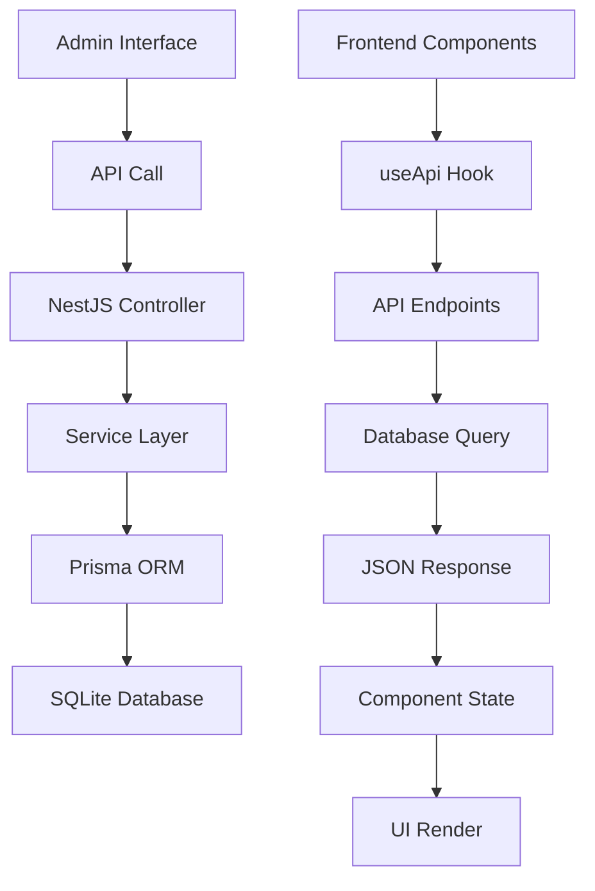

# Sistema de Banners Dinâmicos - Documentação Técnica

## Visão Geral

O Sistema de Banners Dinâmicos foi implementado para permitir o gerenciamento completo de banners promocionais, hero banners e banners de departamento através de uma interface administrativa, eliminando a necessidade de alterações no código para atualizações de conteúdo.

## Arquitetura do Sistema

### Backend (NestJS + Prisma)

#### 1. Modelo de Dados (Prisma Schema)

```prisma
model Banner {
  id          String   @id @default(cuid())
  title       String
  subtitle    String?
  description String?
  buttonText  String?
  buttonLink  String?
  imageUrl    String?
  bgColor     String?
  textColor   String   @default("text-white")
  type        BannerType
  position    Int      @default(0)
  active      Boolean  @default(true)
  startDate   DateTime?
  endDate     DateTime?
  createdAt   DateTime @default(now())
  updatedAt   DateTime @updatedAt

  @@map("banners")
}

enum BannerType {
  HERO
  PROMOTIONAL
  DEPARTMENT
}
```

#### 2. Estrutura do Backend

**Arquivos Principais:**
- `src/banners/banners.module.ts` - Módulo principal
- `src/banners/banners.controller.ts` - Controlador REST API
- `src/banners/banners.service.ts` - Lógica de negócio
- `src/banners/dto/create-banner.dto.ts` - DTOs de validação
- `src/banners/dto/update-banner.dto.ts` - DTOs de atualização

#### 3. Endpoints da API

| Método | Endpoint | Descrição | Autenticação |
|--------|----------|-----------|--------------|
| GET | `/banners` | Lista banners com filtros | Não |
| GET | `/banners/:id` | Busca banner específico | Não |
| POST | `/banners` | Cria novo banner | Admin/Manager |
| PATCH | `/banners/:id` | Atualiza banner | Admin/Manager |
| DELETE | `/banners/:id` | Remove banner | Admin |
| PATCH | `/banners/:id/toggle-active` | Alterna status | Admin/Manager |
| PATCH | `/banners/reorder` | Reordena banners | Admin/Manager |
| GET | `/banners/stats` | Estatísticas | Admin/Manager |

#### 4. Funcionalidades do Service

```typescript
class BannersService {
  // CRUD básico
  create(createBannerDto: CreateBannerDto)
  findAll(type?: string, active?: boolean)
  findById(id: string)
  update(id: string, updateBannerDto: UpdateBannerDto)
  remove(id: string)
  
  // Funcionalidades especiais
  toggleActive(id: string)
  updatePositions(bannerIds: string[])
  getBannerStats()
}
```

### Frontend (Next.js + TypeScript)

#### 1. Estrutura de Componentes

**Componentes Dinâmicos:**
- `HeroCarousel.tsx` - Carrossel principal (tipo HERO)
- `PromotionalBanners.tsx` - Banners promocionais (tipo PROMOTIONAL)
- `DynamicDepartmentBanners.tsx` - Banners de departamento (tipo DEPARTMENT)

**Componentes Administrativos:**
- `admin/banners/page.tsx` - Lista de banners
- `admin/banners/novo/page.tsx` - Criação de banner
- `admin/banners/[id]/page.tsx` - Visualização detalhada
- `admin/banners/[id]/editar/page.tsx` - Edição de banner

**Componentes UI:**
- `ui/BannerPreview.tsx` - Preview em tempo real
- `ui/ImageUpload.tsx` - Upload de imagens
- `ui/Loading.tsx` - Estados de carregamento

#### 2. Hook de API

```typescript
// hooks/useApi.ts - useBanners()
const bannersApi = useBanners();

// Métodos disponíveis:
bannersApi.getBanners({ type: 'HERO', active: true })
bannersApi.getBanner(id)
bannersApi.createBanner(bannerData)
bannersApi.updateBanner(id, bannerData)
bannersApi.deleteBanner(id)
bannersApi.toggleBannerActive(id)
bannersApi.reorderBanners(bannerIds)
bannersApi.getBannerStats()
```

## Tipos de Banners

### 1. HERO Banners
- **Localização:** Carrossel principal da homepage
- **Características:** Imagens grandes, texto sobreposto, call-to-action
- **Dimensões recomendadas:** 1920x600px

### 2. PROMOTIONAL Banners
- **Localização:** Seção de banners promocionais
- **Características:** Grid responsivo, gradientes de fundo, ícones
- **Layout:** 3 colunas em desktop, responsivo

### 3. DEPARTMENT Banners
- **Localização:** Seção de departamentos especiais
- **Características:** Ícones circulares, layout compacto
- **Layout:** 6 colunas em desktop, responsivo

## Funcionalidades Implementadas

### ✅ Gerenciamento Completo
- [x] Criação, edição e exclusão de banners
- [x] Upload de imagens
- [x] Preview em tempo real
- [x] Ativação/desativação
- [x] Reordenação por posição

### ✅ Interface Administrativa
- [x] Lista paginada com filtros
- [x] Formulários de criação/edição
- [x] Visualização detalhada
- [x] Estados de carregamento
- [x] Notificações de sucesso/erro

### ✅ Frontend Dinâmico
- [x] Carregamento automático de banners
- [x] Fallback para dados estáticos
- [x] Estados de loading
- [x] Responsividade completa

### ✅ Validações e Segurança
- [x] DTOs de validação no backend
- [x] Autenticação JWT
- [x] Controle de acesso por roles
- [x] Sanitização de dados

## Fluxo de Dados



## Configuração e Deploy

### Variáveis de Ambiente

```env
# Backend
DATABASE_URL="file:./dev.db"
JWT_SECRET="your-jwt-secret"
UPLOAD_PATH="./uploads"

# Frontend
NEXT_PUBLIC_API_URL="http://localhost:3001"
```

### Scripts de Inicialização

```bash
# Backend
cd backend-nestjs
npm install
npx prisma db push
npx ts-node prisma/seed.ts
npm run start:dev

# Frontend
cd frontend
npm install
npm run dev
```

## Seed de Dados

O sistema inclui um seed completo com:
- 3 Hero Banners
- 3 Banners Promocionais  
- 6 Banners de Departamento
- Dados de exemplo realistas

## Melhorias Futuras

### 🔄 Funcionalidades Planejadas
- [ ] Agendamento de banners (startDate/endDate)
- [ ] Analytics de cliques
- [ ] A/B Testing
- [ ] Templates pré-definidos
- [ ] Integração com CDN
- [ ] Cache inteligente
- [ ] Versionamento de banners

### 🎨 Melhorias de UI/UX
- [ ] Editor visual drag-and-drop
- [ ] Biblioteca de imagens
- [ ] Filtros avançados
- [ ] Bulk operations
- [ ] Histórico de alterações

## Considerações Técnicas

### Performance
- Lazy loading de imagens
- Cache de API responses
- Otimização de queries
- Compressão de imagens

### Segurança
- Validação de uploads
- Sanitização de URLs
- Rate limiting
- CORS configurado

### Escalabilidade
- Estrutura modular
- Separação de responsabilidades
- APIs RESTful padronizadas
- Tipagem completa TypeScript

## Conclusão

O Sistema de Banners Dinâmicos fornece uma solução completa e escalável para gerenciamento de conteúdo promocional, permitindo atualizações rápidas sem necessidade de deploy de código e mantendo a flexibilidade para futuras expansões.