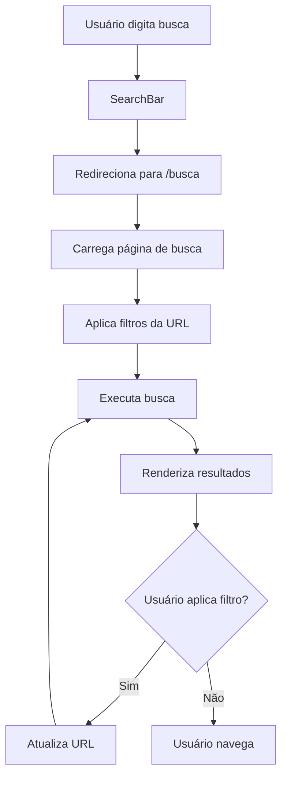

# Sistema de Busca Avançada - Documentação Técnica

## Visão Geral
O sistema de busca avançada oferece uma experiência completa de descoberta de produtos com filtros múltiplos, ordenação flexível e interface intuitiva, permitindo aos usuários encontrar exatamente o que procuram.

## Arquitetura

### Componentes Principais

#### 1. Página de Busca (`frontend/src/app/busca/page.tsx`)
- **Rota:** `/busca`
- **Parâmetros URL:** Suporte completo a query parameters
- **Funcionalidades:**
  - Busca por texto livre
  - Filtros múltiplos simultâneos
  - Ordenação dinâmica
  - Visualização grid/lista
  - Paginação inteligente

#### 2. SearchBar Atualizada (`frontend/src/app/components/header/SearchBar.tsx`)
- **Localização:** Header principal
- **Funcionalidade:** Redirecionamento para página de busca
- **UX:** Busca instantânea com feedback visual

#### 3. Páginas de Categoria (`frontend/src/app/categoria/[slug]/page.tsx`)
- **Rota:** `/categoria/[slug]`
- **Funcionalidades:**
  - Filtros específicos por categoria
  - Breadcrumb de navegação
  - Contagem de produtos
  - Integração com sistema de busca

## Funcionalidades Detalhadas

### 1. Sistema de Filtros

#### Filtros Disponíveis
```typescript
interface SearchFilters {
  query: string;           // Busca por texto
  category: string;        // Categoria específica
  minPrice: number;        // Preço mínimo
  maxPrice: number;        // Preço máximo
  brand: string;           // Marca do produto
  inStock: boolean;        // Apenas produtos em estoque
  featured: boolean;       // Apenas produtos em destaque
}
```

#### Implementação
- **Sidebar Responsiva:** Filtros organizados em sidebar colapsável
- **Aplicação Dinâmica:** Filtros aplicados em tempo real
- **URL Sync:** Estado sincronizado com URL para compartilhamento
- **Reset Inteligente:** Limpeza seletiva de filtros

### 2. Sistema de Ordenação

#### Opções de Ordenação
```typescript
type SortOption = 
  | 'relevance'    // Relevância (padrão)
  | 'price-asc'    // Menor preço
  | 'price-desc'   // Maior preço
  | 'name-asc'     // Nome A-Z
  | 'name-desc'    // Nome Z-A
  | 'newest'       // Mais recentes
  | 'oldest';      // Mais antigos
```

#### Implementação
- **Dropdown Intuitivo:** Seleção fácil de critérios
- **Persistência:** Mantém ordenação entre navegações
- **Performance:** Ordenação otimizada no frontend

### 3. Visualização de Resultados

#### Modos de Visualização
- **Grid:** Cards em grade responsiva (1-4 colunas)
- **Lista:** Visualização horizontal com mais detalhes

#### Componentes
- **ProductCard:** Integrado com favoritos e carrinho
- **Paginação:** Navegação eficiente pelos resultados
- **Estados Vazios:** Feedback quando não há resultados

### 4. Busca por Categoria

#### Funcionalidades Específicas
- **Filtros Contextuais:** Filtros relevantes para cada categoria
- **Breadcrumb:** Navegação hierárquica clara
- **SEO Otimizado:** URLs amigáveis e meta tags dinâmicas

## Fluxo de Busca



## Implementação Técnica

### 1. Gerenciamento de Estado
```typescript
// Estado principal da busca
const [searchState, setSearchState] = useState({
  query: '',
  filters: defaultFilters,
  sortBy: 'relevance',
  viewMode: 'grid',
  currentPage: 1
});

// Sincronização com URL
useEffect(() => {
  const params = new URLSearchParams(searchParams);
  // Atualiza estado baseado na URL
}, [searchParams]);
```

### 2. Filtros Dinâmicos
```typescript
// Aplicação de filtros
const filteredProducts = useMemo(() => {
  return products.filter(product => {
    // Filtro por texto
    if (query && !product.name.toLowerCase().includes(query.toLowerCase())) {
      return false;
    }
    
    // Filtro por preço
    if (product.price < minPrice || product.price > maxPrice) {
      return false;
    }
    
    // Outros filtros...
    return true;
  });
}, [products, filters]);
```

### 3. Ordenação Otimizada
```typescript
// Sistema de ordenação
const sortedProducts = useMemo(() => {
  const sorted = [...filteredProducts];
  
  switch (sortBy) {
    case 'price-asc':
      return sorted.sort((a, b) => a.price - b.price);
    case 'price-desc':
      return sorted.sort((a, b) => b.price - a.price);
    case 'name-asc':
      return sorted.sort((a, b) => a.name.localeCompare(b.name));
    // Outros casos...
    default:
      return sorted;
  }
}, [filteredProducts, sortBy]);
```

## Interface do Usuário

### 1. Layout Responsivo
```css
/* Grid responsivo */
.products-grid {
  @apply grid gap-6;
  grid-template-columns: repeat(auto-fill, minmax(280px, 1fr));
}

/* Sidebar colapsável */
.filters-sidebar {
  @apply lg:w-64 w-full lg:sticky lg:top-4;
}
```

### 2. Estados da Interface

#### Loading States
- Skeleton loading para produtos
- Spinner para filtros
- Feedback visual durante busca

#### Empty States
- Nenhum resultado encontrado
- Sugestões de busca alternativa
- Botão para limpar filtros

#### Error States
- Erro de conexão
- Timeout de busca
- Fallback gracioso

### 3. Acessibilidade
- **ARIA Labels:** Filtros e controles bem descritos
- **Keyboard Navigation:** Navegação completa por teclado
- **Screen Reader:** Anúncios de mudanças de estado
- **Focus Management:** Foco visual adequado

## Performance

### 1. Otimizações Implementadas
- **Debounce:** Busca com delay para evitar requests excessivos
- **Memoização:** Cálculos pesados memoizados
- **Lazy Loading:** Imagens carregadas sob demanda
- **Virtual Scrolling:** Para grandes listas de resultados

### 2. Métricas de Performance
```typescript
// Exemplo de medição
const searchStartTime = performance.now();
// ... executa busca
const searchEndTime = performance.now();
console.log(`Busca executada em ${searchEndTime - searchStartTime}ms`);
```

## SEO e URLs

### 1. URLs Amigáveis
```
/busca?q=cimento&categoria=materiais&preco_min=10&preco_max=100&ordenar=preco-asc
/categoria/cimentos?preco_min=50&em_estoque=true
```

### 2. Meta Tags Dinâmicas
```typescript
// Geração de meta tags
const generateMetaTags = (searchParams) => ({
  title: `Busca por "${query}" - Loja Moderna`,
  description: `Encontre ${query} com os melhores preços. ${resultCount} produtos encontrados.`,
  canonical: `/busca?${searchParams.toString()}`
});
```

## Analytics e Monitoramento

### 1. Eventos de Tracking
```typescript
// Eventos importantes
analytics.track('search_performed', {
  query,
  filters: activeFilters,
  resultCount,
  searchTime: performance.now() - startTime
});

analytics.track('filter_applied', {
  filterType,
  filterValue,
  resultCount
});

analytics.track('search_result_clicked', {
  productId,
  position,
  query
});
```

### 2. Métricas de Negócio
- Taxa de conversão por busca
- Buscas mais populares
- Filtros mais utilizados
- Taxa de abandono na busca
- Tempo médio na página de resultados

## Integração com Backend

### 1. API Endpoints
```typescript
// Endpoints de busca
GET /api/products/search?q={query}&filters={filters}
GET /api/categories/{slug}/products?filters={filters}
GET /api/search/suggestions?q={query}
```

### 2. Estrutura de Response
```typescript
interface SearchResponse {
  products: Product[];
  totalCount: number;
  facets: {
    categories: CategoryFacet[];
    brands: BrandFacet[];
    priceRanges: PriceRangeFacet[];
  };
  suggestions: string[];
}
```

## Testes

### 1. Testes Unitários
```typescript
describe('Search Filters', () => {
  it('should filter products by price range', () => {
    const filtered = applyFilters(mockProducts, {
      minPrice: 10,
      maxPrice: 50
    });
    
    expect(filtered.every(p => p.price >= 10 && p.price <= 50)).toBe(true);
  });
});
```

### 2. Testes de Integração
- Fluxo completo de busca
- Sincronização URL-Estado
- Navegação entre páginas
- Aplicação de filtros múltiplos

### 3. Testes E2E
```typescript
// Exemplo com Playwright
test('should perform complete search flow', async ({ page }) => {
  await page.goto('/');
  await page.fill('[data-testid=search-input]', 'cimento');
  await page.click('[data-testid=search-button]');
  
  await expect(page).toHaveURL(/\/busca\?q=cimento/);
  await expect(page.locator('[data-testid=product-card]')).toHaveCount.greaterThan(0);
});
```

## Roadmap

### Versão Atual (1.5.1)
- ✅ Busca avançada completa
- ✅ Filtros múltiplos
- ✅ Páginas de categoria
- ✅ Ordenação flexível

### Próximas Versões
- [ ] Busca por voz
- [ ] Sugestões inteligentes
- [ ] Busca visual (por imagem)
- [ ] Filtros salvos
- [ ] Histórico de buscas
- [ ] Busca semântica com IA

## Conclusão

O sistema de busca avançada oferece uma experiência completa e profissional, permitindo aos usuários encontrar produtos de forma eficiente e intuitiva. A arquitetura flexível suporta futuras expansões e otimizações baseadas no comportamento dos usuários.