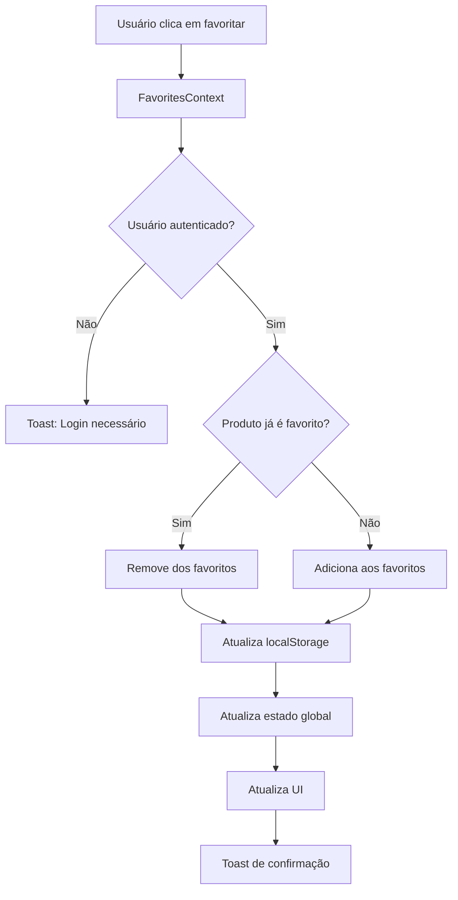

# Sistema de Favoritos - Documentação Técnica

## Visão Geral
O sistema de favoritos permite que usuários autenticados salvem produtos de interesse, criando listas personalizadas com funcionalidades avançadas de gerenciamento, filtros e exportação.

## Arquitetura

### Componentes Principais

#### 1. FavoritesContext (`frontend/src/app/contexts/FavoritesContext.tsx`)
- **Responsabilidade:** Gerenciamento global do estado dos favoritos
- **Persistência:** localStorage por usuário (`favorites_${userId}`)
- **Funcionalidades:**
  - `addToFavorites(product)` - Adiciona produto aos favoritos
  - `removeFromFavorites(productId)` - Remove produto dos favoritos
  - `isFavorite(productId)` - Verifica se produto está nos favoritos
  - `clearFavorites()` - Limpa todos os favoritos
  - `totalFavorites` - Contador total de favoritos

#### 2. Página de Favoritos (`frontend/src/app/favoritos/page.tsx`)
- **Rota:** `/favoritos`
- **Proteção:** Requer autenticação
- **Funcionalidades:**
  - Visualização em grid/lista
  - Filtros por faixa de preço
  - Ordenação múltipla
  - Estatísticas detalhadas
  - Ações em massa

#### 3. FavoriteCard (`frontend/src/app/components/FavoriteCard.tsx`)
- **Responsabilidade:** Componente dedicado para exibir produtos favoritos
- **Suporte:** Ambos os modos de visualização (grid/lista)
- **Integração:** Carrinho e sistema de favoritos

### Integração com Outros Componentes

#### ProductCard
- Botão de favoritos com feedback visual
- Estado dinâmico (favorito/não favorito)
- Integração com FavoritesContext

#### Página de Produto
- Botão de favoritos na interface principal
- Feedback visual do estado atual
- Integração com toast notifications

#### Header Principal
- Contador de favoritos
- Link direto para página de favoritos
- Badge visual quando há favoritos

## Funcionalidades Detalhadas

### 1. Estatísticas
```typescript
interface FavoriteStats {
  totalFavorites: number;      // Total de produtos favoritos
  filteredCount: number;       // Produtos após filtros
  totalValue: number;          // Valor total dos favoritos
  averagePrice: number;        // Preço médio
}
```

### 2. Sistema de Filtros
- **Faixa de Preço:** Filtro por valor mínimo e máximo
- **Filtros Rápidos:** 
  - Até R$ 50
  - R$ 50 - R$ 200
  - Acima de R$ 200

### 3. Ordenação
- **Por Data:** Mais recentes/antigos (baseado na ordem de adição)
- **Por Nome:** A-Z / Z-A
- **Por Preço:** Menor/maior valor

### 4. Ações em Massa
- **Adicionar Todos ao Carrinho:** Adiciona todos os favoritos filtrados
- **Compartilhar Lista:** Via Web Share API ou clipboard
- **Exportar CSV:** Download da lista em formato CSV
- **Limpar Favoritos:** Remove todos os favoritos

### 5. Visualização
- **Grid:** Cards compactos em grade responsiva
- **Lista:** Visualização horizontal com mais detalhes

## Fluxo de Dados



## Persistência de Dados

### LocalStorage
```typescript
// Estrutura da chave
const storageKey = `favorites_${userId}`;

// Estrutura dos dados
interface StoredFavorite {
  id: string;
  name: string;
  price: number;
  sku: string;
  images: Array<{
    url: string;
    alt: string;
  }>;
}
```

### Sincronização
- **Login:** Carrega favoritos do localStorage do usuário
- **Logout:** Limpa estado dos favoritos
- **Mudanças:** Salva automaticamente no localStorage

## Estados da Interface

### Estados Vazios
1. **Não Autenticado:** Tela de login necessário
2. **Sem Favoritos:** Incentivo para explorar produtos
3. **Filtros Sem Resultado:** Opção para limpar filtros

### Estados de Loading
- Adição/remoção de favoritos
- Adição ao carrinho
- Exportação de dados

### Estados de Erro
- Falha ao adicionar ao carrinho
- Erro na exportação
- Problemas de conectividade

## Integração com Backend

### Futuras Melhorias
O sistema atual usa localStorage, mas pode ser expandido para:

```typescript
// API endpoints futuros
POST /api/favorites          // Adicionar favorito
DELETE /api/favorites/:id    // Remover favorito
GET /api/favorites          // Listar favoritos
PUT /api/favorites/sync     // Sincronizar com localStorage
```

## Performance e Otimizações

### Memoização
- `useMemo` para filtros e ordenação
- `useMemo` para cálculos de estatísticas
- Evita re-renderizações desnecessárias

### Lazy Loading
- Componentes carregados sob demanda
- Imagens com loading otimizado

### Debounce
- Filtros de preço com debounce
- Evita atualizações excessivas

## Testes

### Casos de Teste Principais
1. **Adicionar/Remover Favoritos**
2. **Persistência entre Sessões**
3. **Filtros e Ordenação**
4. **Ações em Massa**
5. **Estados de Erro**
6. **Responsividade**

### Exemplo de Teste
```typescript
describe('FavoritesContext', () => {
  it('should add product to favorites', () => {
    const { result } = renderHook(() => useFavorites());
    
    act(() => {
      result.current.addToFavorites(mockProduct);
    });
    
    expect(result.current.isFavorite(mockProduct.id)).toBe(true);
    expect(result.current.totalFavorites).toBe(1);
  });
});
```

## Acessibilidade

### Implementações
- **ARIA Labels:** Botões com descrições claras
- **Keyboard Navigation:** Navegação por teclado
- **Screen Reader:** Compatibilidade com leitores de tela
- **Focus Management:** Foco visual adequado

### Exemplo
```tsx
<button
  aria-label={isFavorite(id) ? 'Remover dos favoritos' : 'Adicionar aos favoritos'}
  title={isFavorite(id) ? 'Remover dos favoritos' : 'Adicionar aos favoritos'}
>
  <Heart className={`h-4 w-4 ${isFavorite(id) ? 'fill-current' : ''}`} />
</button>
```

## Monitoramento e Analytics

### Métricas Importantes
- Taxa de uso do sistema de favoritos
- Produtos mais favoritados
- Conversão de favoritos para compras
- Tempo médio na página de favoritos

### Eventos para Tracking
```typescript
// Exemplos de eventos
analytics.track('favorite_added', { productId, category });
analytics.track('favorite_removed', { productId });
analytics.track('favorites_exported', { count });
analytics.track('favorites_shared', { count });
```

## Roadmap

### Versão Atual (1.5.1)
- ✅ Sistema completo implementado
- ✅ Filtros e ordenação
- ✅ Ações em massa
- ✅ Exportação CSV

### Próximas Versões
- [ ] Sincronização com backend
- [ ] Favoritos compartilháveis (URLs públicas)
- [ ] Notificações de preço
- [ ] Listas múltiplas (categorização)
- [ ] Integração com sistema de recomendações

## Conclusão

O sistema de favoritos oferece uma experiência completa e profissional, com todas as funcionalidades esperadas em um e-commerce moderno. A arquitetura flexível permite futuras expansões e integrações com outros sistemas da plataforma.