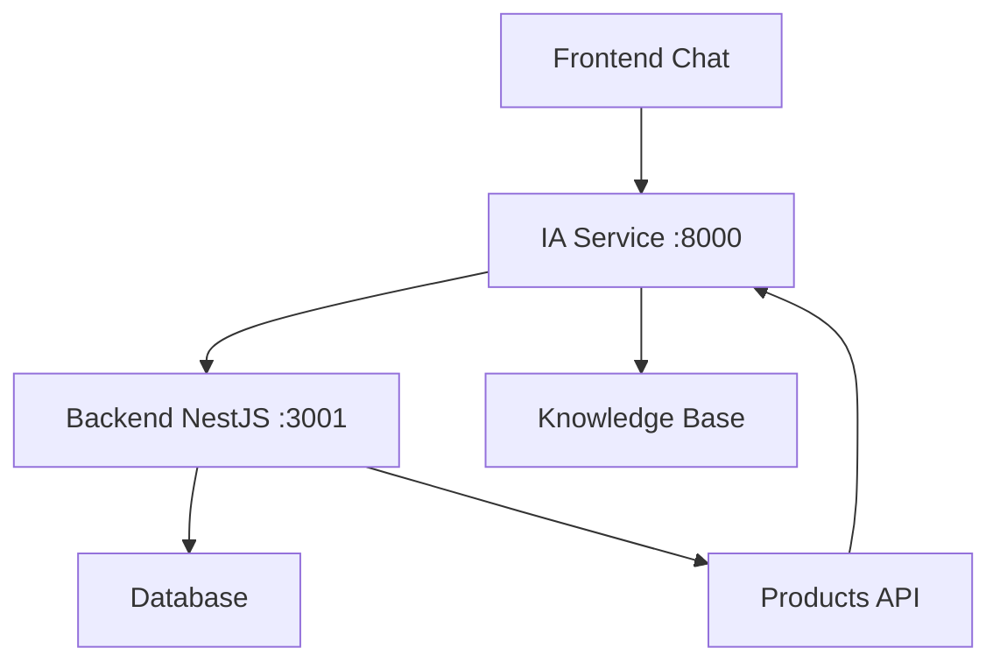

# Sistema de IA "Zé da Obra 2.0" - Documentação Técnica

## Visão Geral

O "Zé da Obra 2.0" é um assistente de IA especializado em materiais de construção, desenvolvido para auxiliar clientes com cálculos, recomendações e dúvidas sobre construção civil. O sistema combina processamento de linguagem natural com conhecimento especializado do setor.

## Arquitetura do Sistema

### Backend IA (FastAPI + Python)

#### 1. Estrutura Principal

```python
# Arquivo: ia/main.py
- FastAPI application
- Endpoints REST para IA
- Integração com backend NestJS
- Sistema de conversas em memória
- Base de conhecimento especializada
```

#### 2. Endpoints Principais

| Método | Endpoint | Descrição | Funcionalidade |
|--------|----------|-----------|----------------|
| POST | `/chat` | Chat com assistente | Conversação natural sobre construção |
| POST | `/calculate-materials` | Calculadora de materiais | Cálculos automáticos por projeto |
| POST | `/recommend-products` | Recomendações | Sugestões personalizadas de produtos |
| GET | `/conversation/{id}` | Histórico de conversa | Recupera conversas anteriores |
| DELETE | `/conversation/{id}` | Limpar conversa | Remove histórico específico |

#### 3. Modelos de Dados

```python
class ChatRequest(BaseModel):
    message: str
    context: Optional[Dict[str, Any]] = {}
    conversation_id: Optional[str] = None

class ChatResponse(BaseModel):
    response: str
    suggestions: List[str] = []
    products: List[Dict[str, Any]] = []
    conversation_id: str

class MaterialCalculationRequest(BaseModel):
    project_type: str  # casa, muro, piso
    dimensions: Dict[str, float]
    specifications: Optional[Dict[str, Any]] = {}
```

### Frontend (Next.js + TypeScript)

#### 1. Componentes Principais

**ZeDaObraChat.tsx**
- Interface de chat flutuante
- Histórico de mensagens
- Sugestões interativas
- Produtos recomendados inline

**MaterialCalculator.tsx**
- Calculadora interativa
- Múltiplos tipos de projeto
- Resultados detalhados
- Recomendações profissionais

**ChatButton.tsx**
- Botão flutuante de acesso
- Indicador de status online
- Tooltip informativo

#### 2. Páginas Especializadas

- `/calculadora` - Página dedicada à calculadora
- `/admin/ia` - Painel administrativo da IA

## Funcionalidades Implementadas

### 🤖 Chat Assistente

#### Capacidades:
- **Reconhecimento de Intenções:**
  - Cálculos de materiais
  - Recomendações de produtos
  - Consultas de preços
  - Dicas de construção

- **Base de Conhecimento:**
  - Cimento: tipos, quantidades, aplicações
  - Tijolos: cálculos por m², especificações
  - Tintas: cobertura, tipos, aplicação
  - Materiais diversos: características e usos

- **Integração com Produtos:**
  - Busca automática no catálogo
  - Recomendações contextuais
  - Preços atualizados

#### Exemplo de Interação:
```
Usuário: "Quanto de cimento preciso para uma casa de 100m²?"

Zé da Obra: "Para uma casa de 100m², você precisará de aproximadamente 50 sacos de cimento de 50kg.

💡 Dicas importantes:
• Armazene em local seco
• Use dentro do prazo de validade
• Misture na proporção correta

Produtos recomendados:
- Cimento CP II 50kg - R$ 25,90"
```

### 🧮 Calculadora de Materiais

#### Tipos de Projeto Suportados:

**1. Casa/Construção**
- Input: Área total (m²)
- Cálculos: Cimento, tijolos, areia
- Fórmulas: Baseadas em padrões da construção civil

**2. Muro/Cerca**
- Input: Comprimento e altura
- Cálculos: Blocos, cimento, areia
- Considerações: Fundação e estrutura

**3. Piso/Revestimento**
- Input: Comprimento e largura
- Cálculos: Área total automática
- Materiais: Pisos, argamassa, rejunte

#### Algoritmos de Cálculo:

```python
# Exemplo: Casa
def calculate_house_materials(area):
    cement_bags = int(area * 0.5)  # 0.5 sacos por m²
    bricks = int(area * 25)        # 25 tijolos por m²
    sand_m3 = area * 0.1           # 0.1 m³ por m²
    
    return {
        "materials": [
            {"name": "Cimento CP II 50kg", "quantity": cement_bags, ...},
            {"name": "Tijolo Cerâmico", "quantity": bricks, ...},
            {"name": "Areia Média", "quantity": sand_m3, ...}
        ],
        "total_cost": calculate_total_cost(materials),
        "recommendations": get_recommendations()
    }
```

### 🎯 Sistema de Recomendações

#### Critérios de Recomendação:
- **Contexto da Consulta:** Análise da pergunta do usuário
- **Categoria de Produto:** Filtragem por tipo de material
- **Faixa de Orçamento:** Produtos dentro do budget
- **Popularidade:** Produtos mais vendidos
- **Qualidade:** Avaliações e especificações

#### Exemplo de Recomendação:
```json
{
  "products": [
    {
      "name": "Cimento Votoran CP II 50kg",
      "price": 25.90,
      "category": "Cimento",
      "rating": 4.8,
      "reason": "Melhor custo-benefício para sua obra"
    }
  ],
  "explanation": "Baseado na sua consulta sobre cimento para casa, recomendo produtos de alta qualidade com bom preço.",
  "alternatives": [...]
}
```

## Integração com Backend

### Comunicação entre Serviços



### Endpoints de Integração:

**IA Service → Backend NestJS:**
- `GET /products` - Busca produtos
- `GET /categories` - Lista categorias
- `GET /products/search` - Busca avançada

**Configuração:**
```python
BACKEND_URL = "http://localhost:3001"

async def get_products_from_backend(query: str):
    async with httpx.AsyncClient() as client:
        response = await client.get(f"{BACKEND_URL}/products", 
                                  params={"search": query})
        return response.json()
```

## Configuração e Deploy

### Variáveis de Ambiente

```env
# IA Service (.env)
OPENAI_API_KEY=your_openai_api_key_here
BACKEND_URL=http://localhost:3001
MODEL_NAME=gpt-3.5-turbo
MAX_TOKENS=1000
TEMPERATURE=0.7
MAX_CONVERSATION_LENGTH=50
CONVERSATION_TIMEOUT=3600
```

### Dependências Python

```txt
fastapi==0.104.1
uvicorn[standard]==0.24.0
pydantic==2.5.0
python-dotenv==1.0.0
httpx==0.25.2
openai==1.3.0
```

### Scripts de Inicialização

```bash
# IA Service
cd ia
pip install -r requirements.txt
python main.py

# Ou com uvicorn
uvicorn main:app --host 0.0.0.0 --port 8000 --reload
```

## Interface Administrativa

### Painel de Controle (`/admin/ia`)

#### Métricas Disponíveis:
- **Conversas Totais:** Número de sessões de chat
- **Mensagens:** Total de interações
- **Tempo de Resposta:** Performance média
- **Satisfação:** Rating dos usuários

#### Configurações:
- **Modelo de IA:** Seleção do modelo (GPT-3.5, GPT-4, Local)
- **Parâmetros:** Tokens máximos, temperatura
- **Funcionalidades:** Habilitar/desabilitar recursos
- **Timeout:** Configuração de tempo limite

#### Ações Rápidas:
- Reiniciar serviço de IA
- Limpar conversas antigas
- Gerar relatórios de performance
- Testar conectividade

## Melhorias Futuras

### 🔄 Funcionalidades Planejadas

#### Curto Prazo:
- [ ] Integração com OpenAI GPT-4
- [ ] Persistência de conversas em Redis
- [ ] Sistema de feedback dos usuários
- [ ] Métricas avançadas de uso

#### Médio Prazo:
- [ ] Reconhecimento de voz
- [ ] Análise de imagens de projetos
- [ ] Integração com fornecedores
- [ ] Sistema de orçamentos automáticos

#### Longo Prazo:
- [ ] IA preditiva para demanda
- [ ] Realidade aumentada para visualização
- [ ] Integração com IoT para canteiros
- [ ] Machine Learning para otimização

### 🎨 Melhorias de UX

#### Interface:
- [ ] Temas personalizáveis
- [ ] Modo escuro
- [ ] Atalhos de teclado
- [ ] Histórico persistente

#### Funcionalidades:
- [ ] Compartilhamento de cálculos
- [ ] Exportação para PDF
- [ ] Integração com calendário
- [ ] Notificações push

## Considerações Técnicas

### Performance
- **Cache de Respostas:** Respostas frequentes em cache
- **Otimização de Queries:** Busca eficiente no backend
- **Lazy Loading:** Carregamento sob demanda
- **Debounce:** Evita requisições excessivas

### Segurança
- **Rate Limiting:** Controle de requisições
- **Sanitização:** Limpeza de inputs
- **CORS:** Configuração adequada
- **Logs:** Auditoria de interações

### Escalabilidade
- **Microserviços:** Arquitetura independente
- **Load Balancing:** Distribuição de carga
- **Horizontal Scaling:** Múltiplas instâncias
- **Database Sharding:** Particionamento de dados

## Monitoramento e Analytics

### Métricas de Negócio
- **Taxa de Conversão:** Chat → Compra
- **Satisfação do Cliente:** Ratings e feedback
- **Tempo de Resolução:** Eficiência das respostas
- **Produtos Mais Recomendados:** Insights de demanda

### Métricas Técnicas
- **Latência de Resposta:** Performance da IA
- **Taxa de Erro:** Falhas no sistema
- **Uso de Recursos:** CPU, memória, rede
- **Disponibilidade:** Uptime do serviço

## Conclusão

O sistema "Zé da Obra 2.0" representa uma evolução significativa na experiência do cliente, oferecendo assistência especializada e cálculos precisos. A arquitetura modular permite expansões futuras e a integração com outros sistemas da plataforma.

**Status Atual:** ✅ **IMPLEMENTADO E FUNCIONAL**

**Próximos Passos:**
1. Testes em ambiente de produção
2. Coleta de feedback dos usuários
3. Otimizações de performance
4. Implementação de funcionalidades avançadas