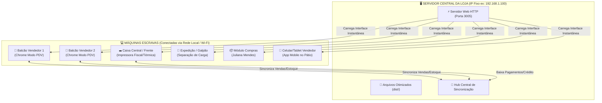

# 🚀 Guia de Implantação: Servidor Central & Máquinas Escravas (HubObra ERP)

Este guia explica o passo a passo completo para colocar o **HubObra ERP Local-First** rodando no **computador servidor da loja** e como conectar todos os **terminais escravos** (Balcões de Vendas, Caixas, Compras, Expedição no Galpão e Celulares dos Vendedores).

---

## 🏗️ Arquitetura Local-First da Loja



---

## 🖥️ PARTE 1: Preparando o Servidor Central da Loja

### 1. Requisitos no Servidor
* Windows 10/11 ou Windows Server ou Linux.
* Conectado ao roteador principal da loja (preferencialmente por **cabo de rede RJ45**).
* Node.js instalado (v18 ou superior).

---

### 2. Passo a Passo de Preparação dos Arquivos no Servidor

#### **Passo 2.1: Gerar o Pacote Otimizado de Produção (`dist/`)**
No computador servidor, abra o terminal na pasta do projeto e execute:
```bash
npm run build
```
> Isso cria a pasta `dist/` com todos os arquivos HTML, Javascript, CSS e imagens compilados e ultraleves (~750KB gzipped).

---

#### **Passo 2.2: Fixar o IP do Servidor na Rede Local**
Para que as máquinas escravas nunca percam a conexão:
1. Pressione `Win + R` ➔ digite `ncpa.cpl` ➔ Pressione Enter.
2. Clique com botão direito na sua placa de rede ➔ **Propriedades**.
3. Selecione **Protocolo IP Versão 4 (TCP/IPv4)** ➔ **Propriedades**.
4. Defina um IP fixo, por exemplo:
   * **Endereço IP:** `192.168.1.100` (ou `192.168.0.100` dependendo do seu roteador)
   * **Máscara:** `255.255.255.0`
   * **Gateway:** `192.168.1.1` (IP do seu roteador)
   * **DNS:** `8.8.8.8` e `1.1.1.1`

---

#### **Passo 2.3: Liberar a Porta 3005 no Firewall do Windows**
Para permitir que outros computadores acessem:
1. Abra o **Prompt de Comando (CMD) como Administrador** no Servidor.
2. Cole o comando abaixo e aperte Enter:
```cmd
netsh advfirewall firewall add rule name="HubObra ERP Porta 3005" dir=in action=allow protocol=TCP localport=3005
```

---

#### **Passo 2.4: Iniciar o Servidor Automaticamente**
Basta dar **dois cliques** no arquivo que criamos na raiz:
👉 **`iniciar-servidor-hubobra.bat`**

O terminal mostrará:
```
Serving!
- Local:    http://localhost:3005
- Network:  http://192.168.1.100:3005
```

> 💡 **Para iniciar sozinho com o Windows:** Pressione `Win + R` ➔ digite `shell:startup` ➔ Cole um atalho do arquivo `iniciar-servidor-hubobra.bat` dentro dessa pasta. Sempre que ligar o servidor da loja, ele já inicia automaticamente!

---

## 💻 PARTE 2: Configurando as Máquinas Escravas (Terminais de Venda e Balcão)

### As máquinas escravas **NÃO** precisam de Node.js, compilação nem banco de dados instalado!
Elas rodam direto no navegador com **máxima velocidade nativa** e armazenamento local.

---

### Opção A: Configuração em 1 Clique (Automática via Script)
1. Copie o arquivo `configurar-terminal-escravo.bat` para a máquina escrava (via pendrive ou rede compartilhada).
2. Dê dois cliques nele.
3. Digite o IP do Servidor (ex: `192.168.1.100`).
4. Ele cria automaticamente o atalho **"HubObra PDV - Loja"** na Área de Trabalho!

---

### Opção B: Configuração Manual (Modo Aplicativo / Kiosk)

1. Na máquina escrava, abra o **Google Chrome** ou **Microsoft Edge**.
2. Acesse:
   ```
   http://192.168.1.100:3005
   ```
3. **Instalar como Aplicativo (PWA):**
   * No Chrome: Clique nos 3 pontinhos no canto superior direito ➔ **Salvar e Compartilhar** ➔ **Instalar HubObra ERP**.
   * O sistema vira um aplicativo independente, sem barra de endereços, abrindo direto na tela cheia!

4. **Criar Atalho com Parâmetros de Modo PDV:**
   * Crie um atalho na Área de Trabalho com o destino:
   ```cmd
   "C:\Program Files\Google\Chrome\Application\chrome.exe" --app=http://192.168.1.100:3005 --start-maximized
   ```

---

## 📱 PARTE 3: Celulares e Tablets dos Vendedores no Pátio

Para os vendedores que andam pelo estoque ou pátio de brita/areia com o celular:
1. Conecte o celular na mesma rede Wi-Fi da loja.
2. Abra o navegador do celular (Chrome ou Safari) e digite:
   ```
   http://192.168.1.100:3005
   ```
3. Toque no menu do navegador ➔ **"Adicionar à Tela Inicial"**.
4. O ícone da HubObra aparecerá como um aplicativo nativo no celular do vendedor!

---

## 🛡️ Vantagens do Modelo Local-First HubObra

| Recurso | Benefício para a Loja |
| :--- | :--- |
| **Zero Delay no Balcão** | As telas abrem instantaneamente em menos de 10 milissegundos. |
| **Resiliência a Falhas de Internet** | Se o link da operadora cair, os vendedores continuam lançando orçamentos e vendas normalmente. |
| **Segurança por Funções (RBAC)** | Vendedor só vê balcão; Comprador vê margens e fornecedores; Caixa fecha pagamentos. |
| **Baixo Custo de Hardware** | Máquinas escravas antigas ou fracas rodam perfeitamente leves. |
